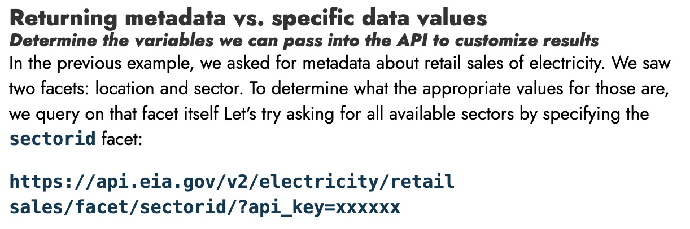

:::::::: questions

* How can I consistently work with the most up-to-date data available?
* How can I work with data from a web API?

::::::::

:::::::: objectives

* Read remote files into `pandas` dataframes
* Investigate the inputs to and outputs from an API

::::::::

## Introduction to remote data

:::: instructor

Prep checklist:

- [ ] make a sticky note that includes the research question: "What was the net electricity generation from natural gas, plant-by-plant, in Colorado from 2020-2023?"
- [ ] pull up the [PUDL viewer with the right table already in search](https://viewer.catalyst.coop/search?q=eia923%20monthly%20generation%20fuel)

::::

We learned last time about opening the EIA 923 data in a variety of formats. That data was stored directly on your hard drive because you cloned the lesson respository in setup - we call that **local data**.

We can also read in data that's stored somewhere else, or **remote data**. That's accessed through a URL, instead of a path on your hard drive.

## Reading remote files into `pandas` directly

You asked around about the `eia923_2022.parquet` file and found out that it came from the [Public Utility Data Liberation project](https://catalyst.coop/pudl/) which updates regularly! You want to get your hands on the newer data, so you go check that out.

Skipping a few 'look at the webpage' steps, you find their [data listings](https://viewer.catalyst.coop/search?q=eia923%20monthly%20generation%20fuel) and find a link to where you can download a Parquet file: `https://s3.us-west-2.amazonaws.com/pudl.catalyst.coop/nightly/core_eia923__monthly_generation_fuel.parquet`.

You *could* download this file, then point `read_parquet` at it. But, since it gets updated sometimes, downloading a new version, checking if it's different from the old one, and managing all the versions on your hard drive seems like a pain.

So let's download the newest version every time you run the code. Maybe `read_parquet` can help... let's check out the documentation.

```python
help(pd.read_parquet)
```

It says that the path "could be a URL." Let's try it!

```python
df = pd.read_parquet("https://s3.us-west-2.amazonaws.com/pudl.catalyst.coop/nightly/core_eia923__monthly_generation_fuel.parquet")

print(df.report_date.max())
```

```output
report_date
2024-04-01    5362
2024-05-01    5395
2024-06-01    5426
2024-07-01    5435
2024-08-01    5450
Name: count, dtype: int64
```

Indeed, `read_parquet()` does handle URLs without a hiccup! You can see that there are updated rows for data through 2024.

:::: callout

Most, but not all, of the `read_*` functions support URLs -  check the docs to make sure this will work!

::::

:::: challenge

Adapt your previous Excel-reading code to read the same Excel file directly from the Internet. GitHub has convenient links for all the files in the repo - you should be able to find the Excel file here: `https://github.com/catalyst-cooperative/open-energy-data-for-all/raw/refs/heads/main/data/eia923_2022.xlsx`

```python
import pandas as pd

pd.read_excel("data/eia923_2022.xlsx", skiprows=5)
```

:::::::: solution

```python
import pandas as pd

pd.read_excel("https://github.com/catalyst-cooperative/open-energy-data-for-all/raw/refs/heads/main/data/eia923_2022.xlsx", skiprows=5)
```
::::::::

::::


:::: discussion

What are some advantages and disadvantages you can imagine for using remote data vs. saving the data to your hard drive (aka **local data**)?

:::::::: solution

Some non-exhaustive ideas:

Remote data pros:

* if someone else updates the data, you always have the most recent version
* you don't need to manage multiple versions of the same data on your hard drive
* if you send your code to someone else, you don't also have to package the data with it

Local data pros:

* you can keep track of different versions of the same data, even if the publisher doesn't
* you only need to download the data once, and then you can read from your disk in the future, which is faster
* if someone else updates the data, your data doesn't change until you actively download a new version
* you can access this without internet!

::::::::

::::

## Using `requests` to download files

It's nice to use functions in the `pd.read_*()` family with a URL, but sometimes you need to do a little bit of reshaping of the data before you can actually use `pd.read_*()`. We saw this with the JSON file earlier, where we had to read in the file, grab the tabular data out of it, and then pass that into `pandas`.

In those cases, you can still use remote data!

While Python has some code in the standard library to help you read data from a URL, the [`requests` library](https://requests.readthedocs.io/en/latest/user/quickstart/) is easier to use and also extremely popular, so we'll focus on using that.

To read a URL we use the [`requests.get()` method](https://requests.readthedocs.io/en/latest/api/#requests.get), which returns a [`requests.Response` object](https://requests.readthedocs.io/en/latest/api/#requests.Response). Let's try using it to read some JSON - the same file we read in the last episode, but without having to save it to disk first!

```python
import requests

response = requests.get("https://raw.githubusercontent.com/catalyst-cooperative/open-energy-data-for-all/refs/heads/main/data/eia923_2022.json")
```

The `Response` object has many useful methods and properties - see `help(response)`. We'll focus on three:
* `response.status_code`, which shows you a high level status of what happened
* `response.text`, which shows you the full response
* `response.json()`, which parses the response text into a Python list or dictionary, assuming the response is indeed in JSON.

First, let's check out `response.status_code`. This shows the [HTTP status code](https://en.wikipedia.org/wiki/List_of_HTTP_status_codes) - it's a three digit number that tells you how the request went. For example, if you make a request for something that doesn't exist, you'll get a `404` status code.

In general, status codes that start with `2` mean everything went fine; `4xx` means you messed up somehow; `5xx` means the computer that's responding to your request ran into some sort of error. Or, `4xx` is your fault, `5xx` is their fault.

```python
response.status_code
```

```output
200
```

Great, the request wasn't a total failure! Now let's check to see what the content looks like:

```python
response.text
```

```output
'{"response":{"warnings":[{"warning":"incomplete return","description":"The API can only return 5000 '...
```

Looks like JSON to me! We could parse that text ourselves, but we might as well just use the built-in functionality of `response.json()`.


```python
eia923_2022_json = response.json()
eia923_2022_json["response"]["data"]
```

This seems to follow the format we saw last time.

```output
[{'period': '2022-12',
  'plantCode': '6761',
  'plantName': 'Rawhide',
  'fuel2002': 'ALL',
  'fuelTypeDescription': 'Total',
  'state': 'CO',
  'stateDescription': 'Colorado',
  'primeMover': 'ALL',
  'generation': '188961',
  'gross-generation': '203283',
  'generation-units': 'megawatthours',
  'gross-generation-units': 'megawatthours'},
 {'period': '2022-12',
  'plantCode': '54142',
  'plantName': 'Hillcrest Pump Station',
  'fuel2002': 'WAT',
  'fuelTypeDescription': 'Hydroelectric Conventional',
  'state': 'CO',
  'stateDescription': 'Colorado',
  'primeMover': 'HY',
  'generation': '342.43',
  'gross-generation': '358.27',
  'generation-units': 'megawatthours',
  'gross-generation-units': 'megawatthours'}]
```

:::::::: challenge

Adapt the JSON reading code from last episode to use requests.get.

```python
import pandas as pd
import json

with open('data/eia923_2022.json') as file:
    eia923_json = json.load(file)

eia923_json_df = pd.DataFrame(eia923_json["response"]["data"])
```

:::: solution

```python
import pandas as pd
import json
import requests

response = requests.get("https://raw.githubusercontent.com/catalyst-cooperative/open-energy-data-for-all/refs/heads/main/data/eia923_2022.json")
eia923_json = response.json()

eia923_json_df = pd.DataFrame(eia923_json["response"]["data"])
```

::::

::::::::


:::: keypoints

* `requests` is useful when you need to reformat the data before shoving it into `pandas`
* `response.status_code` tells you if the request succeeded or why it failed.
* `response.text` gives you the raw response, if you need to check that the data is formatted how you expect
* `response.json()` will parse the response as JSON, which is handy

::::

## Web APIs: Fancy URLs

Suppose someone asks you, "how much natural gas was consumed for electricity generation, totalled across all sectors, in Colorado, for each year between 2020 and 2023?"

You *could* go find the EIA 923 spreadsheets for 2020-2023, download the individual files, do a bunch of filtering and reshaping of the data, and get an answer.

But, in this case, the EIA has another way - their web API. Web APIs are collections of fancy URLs that allow them to be much more flexible than merely downloading individual files. They can save you a lot of work, if you become good at using them.

For example, to answer that question, you can request this URL:


```python
response = requests.get("https://api.eia.gov/v2/electricity/electric-power-operational-data/data?data[]=consumption-for-eg&facets[fueltypeid][]=NG&facets[sectorid][]=99&facets[location][]=CO&frequency=annual&start=2020&end=2023&api_key=3zjKYxV86AqtJWSRoAECir1wQFscVu6lxXnRVKG8")

response.json()
```

Which gives you the amount of natural gas consumed for electricity generation in Colorado, across all sectors, in those years:

```output
{'response': {'total': '4',
  'dateFormat': 'YYYY',
  'frequency': 'annual',
  'data': [{'period': '2020',
    'location': 'CO',
    'stateDescription': 'Colorado',
    'sectorid': '99',
    'sectorDescription': 'All Sectors',
    'fueltypeid': 'NG',
    'fuelTypeDescription': 'natural gas',
    'consumption-for-eg': '141498.781',
    'consumption-for-eg-units': 'thousand Mcf'},
   {'period': '2021',
    'location': 'CO',
    'stateDescription': 'Colorado',
    'sectorid': '99',
    'sectorDescription': 'All Sectors',
    'fueltypeid': 'NG',
    'fuelTypeDescription': 'natural gas',
    'consumption-for-eg': '117512.901',
    'consumption-for-eg-units': 'thousand Mcf'},
   {'period': '2023',
    'location': 'CO',
    'stateDescription': 'Colorado',
    'sectorid': '99',
    'sectorDescription': 'All Sectors',
    'fueltypeid': 'NG',
    'fuelTypeDescription': 'natural gas',
    'consumption-for-eg': '134798.975',
    'consumption-for-eg-units': 'thousand Mcf'},
   {'period': '2022',
    'location': 'CO',
    'stateDescription': 'Colorado',
    'sectorid': '99',
    'sectorDescription': 'All Sectors',
    'fueltypeid': 'NG',
    'fuelTypeDescription': 'natural gas',
    'consumption-for-eg': '127967.696',
    'consumption-for-eg-units': 'thousand Mcf'}],
  'description': 'Monthly and annual electric power operations by state, sector, and energy source.\n    Source: Form EIA-923'},
 'request': {'command': '/v2/electricity/electric-power-operational-data/data/',
  'params': {'data': ['consumption-for-eg'],
   'facets': {'fueltypeid': ['NG'], 'sectorid': ['99'], 'location': ['CO']},
   'frequency': 'annual',
   'start': '2020',
   'end': '2023',
   'api_key': '3zjKYxV86AqtJWSRoAECir1wQFscVu6lxXnRVKG8'}},
 'apiVersion': '2.1.8',
 'ExcelAddInVersion': '2.1.0'}
```

While that URL can seem impossibly complicated at first, we can break it down into a few parts:

* `https://api.eia.gov/` is the **host** - this means we're asking the **EIA API** for something, as opposed to another website.
* `/v2/electricity/electric-power-operational-data/data?`: the **route** - this tells the API what you're looking for. In this case, "electric power operational data."
* The rest of the URL is a bunch of `name=value` pairs split by `&`s - we'll ignore the `&`'s for clarity. These are called **parameters**.
  * `data[]=consumption-for-eg`: "I only want the consumption for electricity generation"
  * `facets[fueltypeid][]=NG`: "with the fuel type ID NG for natural gas"
  * `facets[sectorid][]=99`: "for sector ID 99, which means 'all sectors'"
  * `facets[location][]=CO`: "within the location CO for colorado"
  * `frequency=quarterly`: "at a quarterly frequency"
  * `start=2020`: "starting after 2020, inclusive"
  * `end=2023`: "ending by 2023, inclusive"
  * `api_key=3zjKYxV86AqtJWSRoAECir1wQFscVu6lxXnRVKG8`: a password to prove you have access to the API.


:::: callout
The API key we're using in this lesson is a public one that EIA provides, but it would be polite to request your own API key by clicking the register button on the [EIA open data portal](https://www.eia.gov/opendata/) if you plan on using the API a lot.

Many other APIs will not have a public key, so you'll have to register in one way or another to get one.
::::

Every web API behaves differently, but you only need to be able to do two things to figure any API out:

* read their documentation
* make requests to the API & interpret responses

You can read, and you can use `requests` to make requests. We'll walk through building a similarly complicated query as we just saw, by applying those two skills.

:::: challenge

Make a request to that URL with `requests.get`.

Try removing the `end=2023` parameter from the URL. What happens?

:::::::: solution

You get data all the way until the present day!

::::::::

::::


:::: keypoints

* web APIs can be thought of as bundles of fancy URLs
* each web API is different, but if you can read the documentation and make requests to URLs, you can figure them out

::::

## Case study: EIA API

Let's get started! You can find the [API documentation here](https://www.eia.gov/opendata/documentation.php).

:::: caution
Unfortunately, the EIA API documentation is confusingly formatted and *particularly* hard to read. So we will just include screenshots of the relevant parts.
::::

Let's focus on a slightly different question than we had before - now that we know the aggregated information, we want to drill down.

**"What was the net electricity generation from natural gas, plant-by-plant, in Colorado from 2020-2023?"**

Our first goal is to figure out how to start interacting with the API, and how to map any examples in the documentation to real Python code.

When scrolling through the documentation, we notice a bunch of example URLs. Let's pick a fairly simple one to get started, `https://api.eia.gov/v2/electricity&api_key=xxxxxx`:


We'll need the API key in a lot of places, so we store that in a variable, and then put it into the URL using an "f-string."

:::: callout

F-strings are a compact way to put variables inside strings - all of these make the same string:

```python
variable = "world"

hardcoded = "hello world!"
plus_operator = "hello " + variable + "!"
format_method = "hello {}!".format(variable)
fstring = f"hello {variable}!"
```
::::

```python
api_key = "3zjKYxV86AqtJWSRoAECir1wQFscVu6lxXnRVKG8"

response = requests.get(f"https://api.eia.gov/v2/electricity?api_key={api_key}")
response.json()
```

```output
{'response': {'id': 'electricity',
  'name': 'Electricity',
  'description': 'EIA electricity survey data',
  'routes': [{'id': 'retail-sales',
    'name': 'Electricity Sales to Ultimate Customers',
    'description': 'Electricity sales to ultimate customer by state and sector (number of customers, average price, revenue, and megawatthours of sales).  \n    Sources: Forms EIA-826, EIA-861, EIA-861M'},
   {'id': 'electric-power-operational-data',
    'name': 'Electric Power Operations (Annual and Monthly)',
    'description': 'Monthly and annual electric power operations by state, sector, and energy source.\n    Source: Form EIA-923'},
   {'id': 'rto',
    'name': 'Electric Power Operations (Daily and Hourly)',
    'description': 'Hourly and daily electric power operations by balancing authority.  \n    Source: Form EIA-930'},
   {'id': 'state-electricity-profiles',
    'name': 'State Specific Data',
    'description': 'State Specific Data'},
   {'id': 'operating-generator-capacity',
    'name': 'Inventory of Operable Generators',
    'description': 'Inventory of operable generators in the U.S.\n    Source: Forms EIA-860, EIA-860M'},
   {'id': 'facility-fuel',
    'name': 'Electric Power Operations for Individual Power Plants (Annual and Monthly)',
    'description': 'Annual and monthly electric power operations for individual power plants, by energy source and prime mover\n    Source: Form EIA-923'}]},
 'request': {'command': '/v2/electricity/',
  'params': {'api_key': '3zjKYxV86AqtJWSRoAECir1wQFscVu6lxXnRVKG8'}},
 'apiVersion': '2.1.8',
 'ExcelAddInVersion': '2.1.0'}
```

It looks like there's no actual data here... Going back to the docs, we see:

{alt="A screenshot of the EIA API documentation, showing the `https://api.eia.gov/v2/electricity&api_key=xxxxxx` URL."}

> Discovering datasets should be much easier in APIv2 because the API now self-documents and organizes itself in a data hierarchy. Parent datasets have child datasets, which may have children of their own, and so on. To investigate what datasets are available, we request a parent node. The API will respond with the child datasets (routes) for the path we've requested.

So it seems like there are a variety of different child routes we could request. These look like they're listed under `routes` in the JSON above.

:::: challenge

If we're looking for yearly data about fuel consumption at the plant level, what route should we request next?

:::::::: solution

`facility-fuel`!

::::::::

::::

OK, so let's drill down into one of those child routes.


```python
# to save ourselves some typing, we can also assign the first part of the URL to a variable
base_url = "https://api.eia.gov/v2/electricity"

facility_fuel = requests.get(f"{base_url}/facility-fuel?api_key={api_key}").json()

facility_fuel
```

```output
{'response': {'id': 'facility-fuel',
  'name': 'Electric Power Operations for Individual Power Plants (Annual and Monthly)',
  'description': 'Annual and monthly electric power operations for individual power plants, by energy source and prime mover\n    Source: Form EIA-923',
  'frequency': [{'id': 'monthly',
    'description': 'One data point for each month.',
    'query': 'M',
    'format': 'YYYY-MM'},
   {'id': 'quarterly',
    'description': 'One data point every 3 months.',
    'query': 'Q',
    'format': 'YYYY-"Q"Q'},
   {'id': 'annual',
    'description': 'One data point for each calendar year.',
    'query': 'A',
    'format': 'YYYY'}],
  'facets': [{'id': 'plantCode', 'description': 'Plant ID and Name'},
   {'id': 'fuel2002', 'description': 'Energy Source'},
   {'id': 'state', 'description': 'State'},
   {'id': 'primeMover', 'description': 'Prime Mover'}],
  'data': {'generation': {'alias': 'Net Generation', 'units': 'megawatthours'},
   'gross-generation': {'alias': 'Gross Generation', 'units': 'megawatthours'},
   'generation': {'alias': 'Consumption of Fuels for Electricity Generation and Useful Thermal Output (Physical Units)'},
   'generation-btu': {'alias': 'Consumption of Fuels for Electricity Generation and Useful Thermal Output (BTUs)',
    'units': 'MMBtu'},
   'consumption-for-eg': {'alias': 'Consumption of Fuels for Electricity Generation (Physical Units)'},
   'consumption-for-eg-btu': {'alias': 'Consumption of Fuels for Electricity Generation (BTUs)',
    'units': 'MMBtu'},
   'average-heat-content': {'alias': 'Average Heat Content of Consumed Fuels'}},
  'startPeriod': '2001-01',
  'endPeriod': '2024-11',
  'defaultDateFormat': 'YYYY-MM',
  'defaultFrequency': 'monthly'},
 'request': {'command': '/v2/electricity/facility-fuel/',
  'params': {'api_key': '3zjKYxV86AqtJWSRoAECir1wQFscVu6lxXnRVKG8'}},
 'apiVersion': '2.1.8',
 'ExcelAddInVersion': '2.1.0'}
```

Still no data! But it seems like we're getting closer - there's a `data` field in the response, and also some `frequency` and `facets` information that looks relevant.

What next? Through some more documentation reading, we can find some explanation of this `data` field and a helpful example URL:

{alt="Screenshot of documentation, with relevant text reproduced below"}

> In earlier examples, when we asked about the metadata, the API responded with these available data points [under the 'data' key]:
>
> [...]
>
> Remember, in addition to specifying the column in the data[] parameter, we must also specify /data as the last node in the route:
>
> `https://api.eia.gov/v2/electricity/retail-sales/data/?api_key=XXXXXX&data[]=price`


:::: challenge

Given the above example, and the output for the `facility-fuels` metadata, how do we get the net generation data?

Build off of the earlier request:

```python
facility_fuel = requests.get(f"{base_url}/facility-fuel?api_key={api_key}")

facility_fuel.json()
```

:::::::: solution

```python
net_generation = requests.get(f"{base_url}/facility-fuel/data?data[]=generation&api_key={api_key}")

net_generation.json()
```
::::::::

::::


That data we got above is generation data, but there are still some problems:

* it's monthly, not yearly
* it includes all fuel types
* it includes all states
* it includes all years

Let's tackle these one at a time, starting with the yearly data.

If we look at the original metadata response, we can see that there's a `frequency` key in the metadata... is that usable somehow?

We can look in the documentation for `frequency`, which turns up a bunch of queries that look like:

> `https://api.eia.gov/v2/electricity/retail-sales/data?api_key=xxxxxx&data[]=price&facets[sectorid][]=RES&facets[stateid][]=CO&frequency=monthly`

This seems to indicate we can just pass `frequency` as a parameter like `data[]` - let's try it:

```python
yearly = requests.get(f"{base_url}/facility-fuel/data?data[]=generation&frequency=yearly&api_key={api_key}")

yearly
```

Oops - looks like we made a mistake, that came back with an error message:

```output
{'error': "Invalid frequency 'yearly' provided. The only valid frequencies are 'monthly', 'quarterly', and 'annual'.",
 'code': 400}
```

Easy enough to fix, though - we just have to replace the parameter value with `annual`.


```python
annual = requests.get(f"{base_url}/facility-fuel/data?data[]=generation&frequency=annual&api_key={api_key}")

annual.json()
```

Great, now the output does look annual!

As we accumulate more and more parameters, this starts to get pretty unwieldy to read - fortunately, `requests` allows us to pass in the parameters as a dictionary alongside the request:

```python
annual = requests.get(
    f"{base_url}/facility-fuel/data",
    params={
        "data[]": "generation",
        "frequency": "annual",
        "api_key": api_key
    },
)

annual.json()
```

Next let's filter this to just natural gas. You'll often see the word "faceting" to refer to filtering your data - and each "facet" is one of the dimensions you can filter on.

If we go back to our earlier metadata, we can see a list of such facets:

```python
facility_fuel.json()
```

```output
...
'facets': [{'id': 'plantCode', 'description': 'Plant ID and Name'},
 {'id': 'fuel2002', 'description': 'Energy Source'},
 {'id': 'state', 'description': 'State'},
 {'id': 'primeMover', 'description': 'Prime Mover'}],
...
```

Which shows us that `fuel2002` corresponds to the energy source. To figure out how to properly use this, we need:
* what are the possible values, and which one corresponds to natural gas?
* how do I pass in the value we found above to the `fuel2002` facet?

Let's check the documentation again. We can see
Indeed, there's a [Facets and their available values](https://www.eia.gov/opendata/documentation.php#DataFacetsandtheiravailabl) section:

{alt="Screenshot of EIA documentation, with relevant text quoted below."}

We can see an example for figuring out the possible values, which we can adapt for our needs:

> To determine what the appropriate values for those are, we query on that facet itself Let's try asking for all available sectors by specifying the `sectorid` facet:
>
> `https://api.eia.gov/v2/electricity/retail-sales/facet/sectorid/?api_key=xxxxxx`

```python
fueltypes = requests.get(f"{base_url}/facility-fuel/facet/fuel2002?api_key={api_key}").json()

fueltypes
```

```output
{'response': {'totalFacets': 47,
  'facets': [{'id': 'NG', 'name': 'Natural Gas'},
   {'id': 'LIG', 'name': 'Coal'},
   {'id': 'WDL', 'name': 'Wood Waste Solids'},
   {'id': 'MWH', 'name': 'Other'},
...
```

So we can see that the `NG` value corresponds to "Natural Gas".


Our final question, then, is how do we actually enact this filter? A quick search in the docs for `&facet` will give us this example:

{alt="Screenshot of the URL in the EIA documentation. Text reproduced below."}

> `http://api.eia.gov/v2/electricity/retail-sales/data/?api_key=xxxxxx&facets[stateid][]=CO&facets[sectorid][]=RES&frequency=monthly`

Let's copy this pattern and see if that works:

```python
annual_ng = requests.get(
    f"{base_url}/facility-fuel/data",
    params={
        "data[]": "generation",
        "frequency": "annual",
        "facets[fuel2002][]": "NG",
        "api_key": api_key
    },
)

annual_ng.json()
```

It does seem to filter the outputs to only natural gas data!

:::: challenge

Now we want to limit this to just the state of Colorado - let's update the code to do that.

As before, let's build off the old request.

```python
annual_ng = requests.get(
    "{base_url}/facility-fuel/data",
    params={
        "data[]": "generation",
        "frequency": "annual",
        "facets[fuel2002][]": "NG",
        "api_key": api_key
    },
)

annual_ng.json()
```

:::::::: solution

First, figure out what the facet is called and find the values for it.

```python

states = requests.get(f"{base_url}/facility-fuel/facet/state?api_key={api_key}").json()
states
```

Then apply the facet:

```python
annual_ng_co = requests.get(
    "{base_url}/facility-fuel/data",
    params={
        "data[]": "generation",
        "frequency": "annual",
        "facets[fuel2002][]": "NG",
        "facets[state][]": "CO",
        "api_key": api_key
    },
)

annual_ng_co.json()
```

::::::::

::::

Sweet, now we have yearly natural gas generation for Colorado.

Now we just need to limit it to the right years. We saw the start/end parameters a bit earlier, but let's actually poke at the documentation to see how they're used:

{alt="Screenshot with several examples, reproduced below"}

> Start date
> https://api.eia.gov/v2/electricity/retail-sales/data?api_key=xxxxxx&data[]=price&facets[sectorid][]=RES&facets[stateid][]=CO&frequency=monthly&start=2008-01-31
>
> End date
> https://api.eia.gov/v2/electricity/retail-sales/data?api_key=xxxxxx&data[]=price&facets[sectorid][]=RES&facets[stateid][]=CO&frequency=monthly&end=2008-03-01
>
> Start and end date together
> https://api.eia.gov/v2/electricity/retail-sales/data?api_key=xxxxxx&data[]=price&facets[sectorid][]=RES&facets[stateid][]=CO&frequency=monthly&start=2008-01-31&end=2008-03-01

Let's try out this pattern!

:::: challenge
Limit the results to 2020-2023. Start from your last query:

```python
annual_ng_co = requests.get(
    f"{base_url}/facility-fuel/data",
    params={
        "data[]": "generation",
        "frequency": "annual",
        "facets[fuel2002][]": "NG",
        "facets[state][]": "CO",
        "api_key": api_key
    },
)

annual_ng_co.json()
```

:::::::: solution

```python
annual_ng_co_2020_2023 = requests.get(
    "{base_url}/facility-fuel/data",
    params={
        "data[]": "generation",
        "frequency": "annual",
        "facets[fuel2002][]": "NG",
        "facets[state][]": "CO",
        "start": "2020-01-01",
        "end": "2023-12-31",
        "api_key": api_key
    },
)

annual_ng_co_2020_2023.json()
```
::::::::

::::

Now you've worked through the documentation, played with an API, and built up a complicated API query from scratch! And you've answered your earlier question of **"what was the net generation from natural gas, plant-by-plant, in Colorado from 2020-2023?"**

That was a lot of work, but now you're equipped to answer other similar questions using this API.

:::: discussion

Think back to the metadata you saw - what are some questions can you answer with the `facility-fuel` endpoint?

::::


:::: challenge

### Bonus challenge

Choose one of those questions from the discussion, and use the EIA API to answer it!

::::

:::::::: keypoints

* Many functions in the `pandas.read_*` family can read tabular data from remote servers & cloud storage as if it was on your local computer
* `requests` can get data that's not in the right shape for `pandas.read_*`; you'll have to do the translation from their response format into `pandas.DataFrame` yourself
* web APIs are just collections of fancy URLs, which you can interact with via `requests`
* to learn an API, you need to be able to read the documentation and experiment with the API to see how it responds.

::::::::
