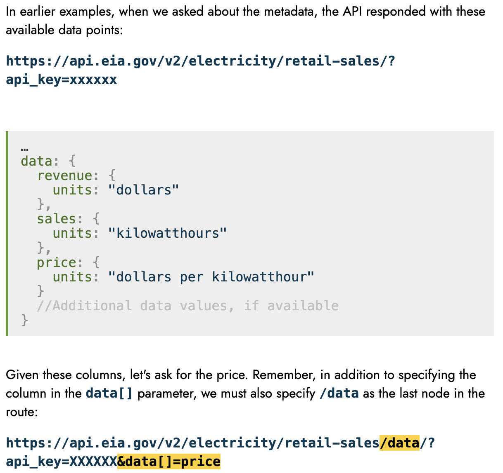

:::::::: questions

* How can I consistently work with the most up-to-date data available?
* How can I work with data from a web API?

::::::::

:::::::: objectives

* Read remote files into `pandas` dataframes
* Investigate the inputs to and outputs from an API

::::::::

## Introduction to remote data

:::: instructor

Prep checklist:

- [ ] make a sticky note that includes the research question: "What was the net electricity generation from natural gas, plant-by-plant, in Colorado from 2020-2023?"
- [ ] pull up the [PUDL viewer with the right table already in search](https://viewer.catalyst.coop/search?q=eia923%20monthly%20generation%20fuel)

::::

We learned last time about opening the EIA 923 data in a variety of formats. That data was stored directly on your hard drive because you cloned the lesson respository in setup - we call that **local data**.

We can also read in data that's stored somewhere else, or **remote data**. That's accessed through a URL, instead of a path on your hard drive.

## Reading remote

### Using `pandas.read_*`

You asked around about the `eia923_2022.parquet` file and found out that it came from the [Public Utility Data Liberation project](https://catalyst.coop/pudl/) which updates regularly! You want to get your hands on the newer data, so you go check that out.

Skipping a few 'look at the webpage' steps, you find their [data listings](https://viewer.catalyst.coop/search?q=eia923%20monthly%20generation%20fuel) and find a link to where you can download a Parquet file: `https://s3.us-west-2.amazonaws.com/pudl.catalyst.coop/nightly/core_eia923__monthly_generation_fuel.parquet`.

You *could* download this file, then point `read_parquet` at it. But, since it gets updated sometimes, downloading a new version, checking if it's different from the old one, and managing all the versions on your hard drive seems like a pain.

So let's download the newest version every time you run the code!

First, let's get some imports & constants out of the way:

```python
import pandas as pd

parquet_example_url = "https://s3.us-west-2.amazonaws.com/pudl.catalyst.coop/nightly/core_eia923__monthly_generation_fuel.parquet"
```

We want to read a Parquet file - does `pd.read_parquet` have anything useful for us? Let's check the documentation.

```python
help(pd.read_parquet)
```

It says that the path "could be a URL." Let's try it!

```python
parquet_example_df = pd.read_parquet(parquet_example_url)
parquet_example_df.report_date.max()
```

```output
datetime.date(2024, 11, 1)
```

Indeed, `read_parquet()` does handle URLs without a hiccup! You can see that there are updated rows for data through 2024.

:::: instructor

Feel free to skip this next challenge if folks are already warmed up.

::::

:::: challenge

Let's check to see if this works for `read_excel` also - here's the URL:

```python
excel_url = "https://github.com/catalyst-cooperative/open-energy-data-for-all/raw/refs/heads/main/data/eia923_2022.xlsx"
```

Note that you will want to use `skiprows=5` to skip some messy header rows, and `nrows=100` to avoid waiting to read the whole file.

::::

:::: solution

```python
pandas.read_excel(excel_url, skiprows=5, nrows=100)
```

::::

:::: callout

Most, but not all, of the `read_*` functions support URLs -  check the docs to make sure this will work!

::::


:::: discussion

What are some advantages and disadvantages you can imagine for using remote data vs. saving the data to your hard drive (aka **local data**)?

:::::::: solution

Some non-exhaustive ideas:

Remote data pros:

* if someone else updates the data, you always have the most recent version
* you don't need to manage multiple versions of the same data on your hard drive
* if you send your code to someone else, you don't also have to package the data with it

Local data pros:

* you can keep track of different versions of the same data, even if the publisher doesn't
* you only need to download the data once, and then you can read from your disk in the future, which is faster
* if someone else updates the data, your data doesn't change until you actively download a new version
* you can access this without internet!

::::::::

::::

### Using `requests`

It's nice to use functions in the `pd.read_*()` family with a URL, but sometimes you need to do a little bit of reshaping of the data before you can actually use `pd.read_*()`. With semi-structured data like JSON, we often have to extract the tabular data within a non-tabular shape before passing that into `pandas`.

In those cases, you can still use remote data!

The [`requests` library](https://requests.readthedocs.io/en/latest/user/quickstart/) is the general way of working with remote files, and we'll use that to deal with data that `pandas` can't handle on its own.

Let's import it, and set up a URL:

```python
import requests

json_example_url = 
"https://raw.githubusercontent.com/catalyst-cooperative/open-energy-data-for-all/refs/heads/main/data/eia923_2022.json"
```

To read a URL we use the [`requests.get()` method](https://requests.readthedocs.io/en/latest/api/#requests.get), which returns a [`requests.Response` object](https://requests.readthedocs.io/en/latest/api/#requests.Response). Let's try using it!

```python
response = requests.get(json_example_url)
```

The `Response` object has many useful methods and properties - see `help(response)`. We'll focus on three:
* `response.status_code`, which shows you a high level status of what happened
* `response.text`, which shows you the full response
* `response.json()`, which parses the response text into a Python list or dictionary, assuming the response is indeed in JSON.

First, let's check out `response.status_code`. This shows the [HTTP status code](https://en.wikipedia.org/wiki/List_of_HTTP_status_codes) - it's a three digit number that tells you how the request went. For example, if you make a request for something that doesn't exist, you'll get a `404` status code.

In general, status codes that start with `2` mean everything went fine; `4xx` means you messed up somehow; `5xx` means the computer that's responding to your request ran into some sort of error. Or, `4xx` is your fault, `5xx` is their fault.

```python
response.status_code
```

```output
200
```

Great, the request wasn't a total failure! Now let's check to see what the content looks like:

```python
response.text
```

```output
'{"response":{"warnings":[{"warning":"incomplete return","description":"The API can only return 5000 '...
```

Looks like JSON to me! We could parse that text ourselves, but we might as well just use the built-in functionality of `response.json()`.


```python
eia923_2022_json = response.json()
eia923_2022_json["response"]["data"]
```

This seems to follow the format we saw last time.

```output
[{'period': '2022-12',
  'plantCode': '6761',
  'plantName': 'Rawhide',
  'fuel2002': 'ALL',
  'fuelTypeDescription': 'Total',
  'state': 'CO',
  'stateDescription': 'Colorado',
  'primeMover': 'ALL',
  'generation': '188961',
  'gross-generation': '203283',
  'generation-units': 'megawatthours',
  'gross-generation-units': 'megawatthours'},
 {'period': '2022-12',
  'plantCode': '54142',
  'plantName': 'Hillcrest Pump Station',
  'fuel2002': 'WAT',
  'fuelTypeDescription': 'Hydroelectric Conventional',
  'state': 'CO',
  'stateDescription': 'Colorado',
  'primeMover': 'HY',
  'generation': '342.43',
  'gross-generation': '358.27',
  'generation-units': 'megawatthours',
  'gross-generation-units': 'megawatthours'}]
```

:::::::: challenge

Adapt the JSON reading code from last episode to use requests.get.

```python
import pandas as pd
import json

with open('data/eia923_2022.json') as file:
    eia923_json = json.load(file)

eia923_json_df = pd.DataFrame(eia923_json["response"]["data"])
```

:::: solution

```python
response = requests.get(json_example_url)
eia923_json_remote = response.json()

eia923_json_df_remote = pd.DataFrame(eia923_json_remote["response"]["data"])
```

::::

::::::::


:::: keypoints

* `requests` is useful when you need to reformat the data before shoving it into `pandas`
* `response.status_code` tells you if the request succeeded or why it failed.
* `response.text` gives you the raw response, if you need to check that the data is formatted how you expect
* `response.json()` will parse the response as JSON, which is handy

::::

## Intro to web APIs

### APIs as fancy URLs

Suppose someone asks you, "how much natural gas was consumed for electricity generation, totalled across all sectors, in Colorado, for each year between 2020 and 2023?"

You *could* go find the EIA 923 spreadsheets for 2020-2023, download the individual files, do a bunch of filtering and reshaping of the data, and get an answer.

But, in this case, the EIA has another way - their web API. Web APIs are collections of fancy URLs that allow them to be much more flexible than merely downloading individual files. They can save you a lot of work, if you become good at using them.

For example, to answer that question, you can request this URL:


```python

response = requests.get("https://api.eia.gov/v2/electricity/electric-power-operational-data/data?data[]=consumption-for-eg&facets[fueltypeid][]=NG&facets[sectorid][]=99&facets[location][]=CO&frequency=annual&start=2020&end=2023&api_key=3zjKYxV86AqtJWSRoAECir1wQFscVu6lxXnRVKG8")
response = requests.get(example_api_url)

response.json()
```

Which gives you:

```output
{'response': {'total': '4',
  'dateFormat': 'YYYY',
  'frequency': 'annual',
  'data': [{'period': '2020',
    'location': 'CO',
    'stateDescription': 'Colorado',
    'sectorid': '99',
    'sectorDescription': 'All Sectors',
    'fueltypeid': 'NG',
    'fuelTypeDescription': 'natural gas',
    'consumption-for-eg': '141498.781',
    'consumption-for-eg-units': 'thousand Mcf'},
   {'period': '2021',
    'location': 'CO',
    'stateDescription': 'Colorado',
    'sectorid': '99',
    'sectorDescription': 'All Sectors',
    'fueltypeid': 'NG',
    'fuelTypeDescription': 'natural gas',
    'consumption-for-eg': '117512.901',
    'consumption-for-eg-units': 'thousand Mcf'},
   {'period': '2023',
    'location': 'CO',
    'stateDescription': 'Colorado',
    'sectorid': '99',
    'sectorDescription': 'All Sectors',
    'fueltypeid': 'NG',
    'fuelTypeDescription': 'natural gas',
    'consumption-for-eg': '134798.975',
    'consumption-for-eg-units': 'thousand Mcf'},
   {'period': '2022',
    'location': 'CO',
    'stateDescription': 'Colorado',
    'sectorid': '99',
    'sectorDescription': 'All Sectors',
    'fueltypeid': 'NG',
    'fuelTypeDescription': 'natural gas',
    'consumption-for-eg': '127967.696',
    'consumption-for-eg-units': 'thousand Mcf'}],
  'description': 'Monthly and annual electric power operations by state, sector, and energy source.\n    Source: Form EIA-923'},
 'request': {'command': '/v2/electricity/electric-power-operational-data/data/',
  'params': {'data': ['consumption-for-eg'],
   'facets': {'fueltypeid': ['NG'], 'sectorid': ['99'], 'location': ['CO']},
   'frequency': 'annual',
   'start': '2020',
   'end': '2023',
   'api_key': '3zjKYxV86AqtJWSRoAECir1wQFscVu6lxXnRVKG8'}},
 'apiVersion': '2.1.8',
 'ExcelAddInVersion': '2.1.0'}
```

### The structure of an API call

While that URL can seem impossibly complicated at first, we can break it down into a few parts:

```python
example_api_url = (
    "https://api.eia.gov" # "host": the high-level name of the API you're accessing
    "/v2/electricity/electric-power-operational-data/data" # "route": the specific aspect of the API you're accessing
    "?" # separator that indicates "everything after this will be a name-value pair"
    "data[]=consumption-for-eg" # name: data[], value: consumption-for-eg ("consumption for electricity generation")
    "&" # separator between each pair
    "facets[fueltypeid][]=NG" # only natural gas data
    "&"
    "facets[sectorid][]=99" # total across all sectors
    "&"
    "facets[location][]=CO" # in Colorado
    "&"
    "frequency=annual" # per year
    "&"
    "start=2020" # starting in 2020
    "&"
    "end=2023" # ending in 2023
    "&"
    "api_key=3zjKYxV86AqtJWSRoAECir1wQFscVu6lxXnRVKG8" # a password to prove you have access to the API
)
```

:::: callout
The API key we're using in this lesson is a public one that EIA provides, but it would be polite to request your own API key by clicking the register button on the [EIA open data portal](https://www.eia.gov/opendata/) if you plan on using the API a lot.

Many other APIs will not have a public key, so you'll have to register in one way or another to get one.
::::

:::: challenge

Try editing the following code to request data for Pennsylvania instead of Colorado.

```python
pennsylvania_api_url = (
    "https://api.eia.gov" # "host": the high-level name of the API you're accessing
    "/v2/electricity/electric-power-operational-data/data" # "route": the specific aspect of the API you're accessing
    "?" # separator that indicates "everything after this will be a name-value pair"
    "data[]=consumption-for-eg" # name: data[], value: consumption-for-eg ("consumption for electricity generation")
    "&" # separator between each pair
    "facets[fueltypeid][]=NG" # only natural gas data
    "&"
    "facets[sectorid][]=99" # total across all sectors
    "&"
    "facets[location][]=CO" # in Colorado
    "&"
    "frequency=annual" # per year
    "&"
    "start=2020" # starting in 2020
    "&"
    "end=2023" # ending in 2023
    "&"
    "api_key=3zjKYxV86AqtJWSRoAECir1wQFscVu6lxXnRVKG8" # a password to prove you have access to the API
)

requests.get(pennsylvania_api_url).json()
```

:::::::: solution


```python
pennsylvania_api_url = (
    "https://api.eia.gov" # "host": the high-level name of the API you're accessing
    "/v2/electricity/electric-power-operational-data/data" # "route": the specific aspect of the API you're accessing
    "?" # separator that indicates "everything after this will be a name-value pair"
    "data[]=consumption-for-eg" # name: data[], value: consumption-for-eg ("consumption for electricity generation")
    "&" # separator between each pair
    "facets[fueltypeid][]=NG" # only natural gas data
    "&"
    "facets[sectorid][]=99" # total across all sectors
    "&"
    "facets[location][]=PA" # in Pennsylvania
    "&"
    "frequency=annual" # per year
    "&"
    "start=2020" # starting in 2020
    "&"
    "end=2023" # ending in 2023
    "&"
    "api_key=3zjKYxV86AqtJWSRoAECir1wQFscVu6lxXnRVKG8" # a password to prove you have access to the API
)

requests.get(pennsylvania_api_url).json()
```

::::::::

::::


Every web API behaves differently, but you only need to be able to do two things to figure any API out:

* read their documentation
* make requests to the API & interpret responses

You can read, and you can use `requests` to make requests. We'll walk through building a similarly complicated query as we just saw, by applying those two skills.

:::: keypoints

* web APIs can be thought of as bundles of fancy URLs
* each web API is different, but if you can read the documentation and make requests to URLs, you can figure them out

::::

## Case study: EIA API

Let's take a deeper dive into the EIA API! You can find the [API documentation here](https://www.eia.gov/opendata/documentation.php).

:::: caution
Unfortunately, the EIA API documentation is confusingly formatted and *particularly* hard to read. So we will just include screenshots of the relevant parts.
::::

Let's focus on a slightly different question than we had before - now that we know the aggregated information, we want to drill down.

**"What was the net electricity generation from natural gas, plant-by-plant, in Colorado from 2020-2023?"**


### Trying out an API request

Our first goal is to figure out how to start interacting with the API, and how to map any examples in the documentation to real Python code.

When scrolling through the documentation, we notice a bunch of example URLs. Let's pick a fairly simple one to get started, `https://api.eia.gov/v2/electricity&api_key=xxxxxx`:

We'll need the API key in a lot of places, so we store that in a variable, and then put it into the URL using an "f-string."

:::: callout

F-strings are a compact way to put variables inside strings - all of these make the same string:

```python
variable = "world"

hardcoded = "hello world!"
plus_operator = "hello " + variable + "!"
format_method = "hello {}!".format(variable)
fstring = f"hello {variable}!"
```
::::

```python
api_key = "3zjKYxV86AqtJWSRoAECir1wQFscVu6lxXnRVKG8"

electricity_response = requests.get(f"https://api.eia.gov/v2/electricity?api_key={api_key}")
electricity_response.json()
```

```output
{'response': {'id': 'electricity',
  'name': 'Electricity',
  'description': 'EIA electricity survey data',
  'routes': [{'id': 'retail-sales',
    'name': 'Electricity Sales to Ultimate Customers',
    'description': 'Electricity sales to ultimate customer by state and sector (number of customers, average price, revenue, and megawatthours of sales).  \n    Sources: Forms EIA-826, EIA-861, EIA-861M'},
   {'id': 'electric-power-operational-data',
    'name': 'Electric Power Operations (Annual and Monthly)',
    'description': 'Monthly and annual electric power operations by state, sector, and energy source.\n    Source: Form EIA-923'},
   {'id': 'rto',
    'name': 'Electric Power Operations (Daily and Hourly)',
    'description': 'Hourly and daily electric power operations by balancing authority.  \n    Source: Form EIA-930'},
   {'id': 'state-electricity-profiles',
    'name': 'State Specific Data',
    'description': 'State Specific Data'},
   {'id': 'operating-generator-capacity',
    'name': 'Inventory of Operable Generators',
    'description': 'Inventory of operable generators in the U.S.\n    Source: Forms EIA-860, EIA-860M'},
   {'id': 'facility-fuel',
    'name': 'Electric Power Operations for Individual Power Plants (Annual and Monthly)',
    'description': 'Annual and monthly electric power operations for individual power plants, by energy source and prime mover\n    Source: Form EIA-923'}]},
 'request': {'command': '/v2/electricity/',
  'params': {'api_key': '3zjKYxV86AqtJWSRoAECir1wQFscVu6lxXnRVKG8'}},
 'apiVersion': '2.1.8',
 'ExcelAddInVersion': '2.1.0'}
```

It looks like there's no actual data here. Let's take a look at the docs.

:::: challenge

[In this section](https://www.eia.gov/opendata/documentation.php#Examiningametadatarequ), the docs say:

> Discovering datasets should be much easier in APIv2 because the API now self-documents and organizes itself in a data hierarchy. Parent datasets have child datasets, which may have children of their own, and so on. To investigate what datasets are available, we request a parent node. The API will respond with the child datasets (routes) for the path we've requested.

If we're looking for yearly data about fuel consumption at the plant level, what route should we request next?

:::::::: solution

`facility-fuel`!

```python
facility_fuel = requests.get(f"https://api.eia.gov/v2/electricity/facility-fuel?api_key={api_key}").json()

facility_fuel
```

```output
{'response': {'id': 'facility-fuel',
  'name': 'Electric Power Operations for Individual Power Plants (Annual and Monthly)',
  'description': 'Annual and monthly electric power operations for individual power plants, by energy source and prime mover\n    Source: Form EIA-923',
  'frequency': [{'id': 'monthly',
    'description': 'One data point for each month.',
    'query': 'M',
    'format': 'YYYY-MM'},
   {'id': 'quarterly',
    'description': 'One data point every 3 months.',
    'query': 'Q',
    'format': 'YYYY-"Q"Q'},
   {'id': 'annual',
    'description': 'One data point for each calendar year.',
    'query': 'A',
    'format': 'YYYY'}],
  'facets': [{'id': 'plantCode', 'description': 'Plant ID and Name'},
   {'id': 'fuel2002', 'description': 'Energy Source'},
   {'id': 'state', 'description': 'State'},
   {'id': 'primeMover', 'description': 'Prime Mover'}],
  'data': {'generation': {'alias': 'Net Generation', 'units': 'megawatthours'},
   'gross-generation': {'alias': 'Gross Generation', 'units': 'megawatthours'},
   'generation': {'alias': 'Consumption of Fuels for Electricity Generation and Useful Thermal Output (Physical Units)'},
   'generation-btu': {'alias': 'Consumption of Fuels for Electricity Generation and Useful Thermal Output (BTUs)',
    'units': 'MMBtu'},
   'consumption-for-eg': {'alias': 'Consumption of Fuels for Electricity Generation (Physical Units)'},
   'consumption-for-eg-btu': {'alias': 'Consumption of Fuels for Electricity Generation (BTUs)',
    'units': 'MMBtu'},
   'average-heat-content': {'alias': 'Average Heat Content of Consumed Fuels'}},
  'startPeriod': '2001-01',
  'endPeriod': '2024-11',
  'defaultDateFormat': 'YYYY-MM',
  'defaultFrequency': 'monthly'},
 'request': {'command': '/v2/electricity/facility-fuel/',
  'params': {'api_key': '3zjKYxV86AqtJWSRoAECir1wQFscVu6lxXnRVKG8'}},
 'apiVersion': '2.1.8',
 'ExcelAddInVersion': '2.1.0'}
```

::::::::

::::


### Getting actual data

Requesting `electricity/facility-fuel` still doesn't give us any data, but it seems like we're getting closer -
there's a `data` field in the response, and also some `frequency` and `facets` information that looks relevant.

What next? Through some more [documentation reading](https://www.eia.gov/opendata/documentation.php#Facets), we can find some explanation of this `data` field and a helpful example URL:

{alt="Screenshot of documentation, with relevant text reproduced below"}

> In earlier examples, when we asked about the metadata, the API responded with these available data points [under the 'data' key]:
>
> [...]
>
> Remember, in addition to specifying the column in the data[] parameter, we must also specify /data as the last node in the route:
>
> `https://api.eia.gov/v2/electricity/retail-sales/data/?api_key=XXXXXX&data[]=price`

Given the above example, and the output for the `facility-fuels` metadata, we can get the net generation data:

First, let's see what data is available using that 'data' key they mentioned:

```python
base_url = "https://api.eia.gov/v2/electricity"

facility_fuels_metadata = requests.get(f"{base_url}/facility-fuel?api_key={api_key}")

facility_fuels_metadata.json()["response"]["data"]
```

```output
{'generation': {'alias': 'Net Generation', 'units': 'megawatthours'},
 'gross-generation': {'alias': 'Gross Generation', 'units': 'megawatthours'},
 'total-consumption': {'alias': 'Consumption of Fuels for Electricity Generation and Useful Thermal Output (Physical Units)'},
 'total-consumption-btu': {'alias': 'Consumption of Fuels for Electricity Generation and Useful Thermal Output (BTUs)',
  'units': 'MMBtu'},
 'consumption-for-eg': {'alias': 'Consumption of Fuels for Electricity Generation (Physical Units)'},
 'consumption-for-eg-btu': {'alias': 'Consumption of Fuels for Electricity Generation (BTUs)',
  'units': 'MMBtu'},
 'average-heat-content': {'alias': 'Average Heat Content of Consumed Fuels'}}
```

`"generation"` looks like what we want - let's try using it!

```python
net_generation = requests.get(f"{base_url}/facility-fuel/data?data[]=generation&api_key={api_key}")

net_generation.json()
```

### Filtering the data

That data we got above is generation data, but there are still some problems:

* it includes all fuel types
* it includes all states
* it includes all years
* it's monthly, not yearly

Let's tackle these one at a time, starting with the fuel types.

We can read the documentation a bit more, and find [this section](https://www.eia.gov/opendata/documentation.php#Frequency) talking about:

> Facets enable us to filter the data of concern to us, shrinking the size of the returns to a more manageable size.
>
> For example, our retail sales of electricity has the location and sector facets. If we query the route (without specifying /data), the API will tell us the facets that are relevant to that route.
 
So we learn two things:

1. "facets" is a word associated with filtering your data.
2. let's check out that metadata to figure out what facets are available!

```python
facility_fuels_metadata.json()["response"]
```

```output
...
 'facets': [{'id': 'plantCode', 'description': 'Plant ID and Name'},
  {'id': 'fuel2002', 'description': 'Energy Source'},
  {'id': 'state', 'description': 'State'},
  {'id': 'primeMover', 'description': 'Prime Mover'}],
...
```

Looks like `fuel2002` is the facet we want to use... but how do we use it? ? A quick search in the docs for `&facet` will give us this example:

> `http://api.eia.gov/v2/electricity/retail-sales/data/?api_key=xxxxxx&facets[stateid][]=CO&facets[sectorid][]=RES&frequency=monthly`

Let's try copying this pattern.

As we accumulate more and more parameters, this starts to get pretty unwieldy to read - fortunately, `requests` allows us to pass in the parameters as a dictionary alongside the request:

```python
gas_only = requests.get(
    f"{base_url}/facility-fuel/data",
    params={
        "data[]": "generation",
        "facets[fuel2002][]": "gas",
        "api_key": api_key
    },
)

gas_only.json()
```

It returns this un-helpful empty result, though... maybe "gas" isn't the right value to pass in.

```output
{'response': {'total': '0',
  'dateFormat': 'YYYY-MM',
  'frequency': 'monthly',
  'data': [],
  'description': 'Annual and monthly electric power operations for individual power plants, by energy source and prime mover\n    Source: Form EIA-923'},
 'request': {'command': '/v2/electricity/facility-fuel/data/',
  'params': {'data': ['generation'],
   'facets': {'fuel2002': ['gas']},
   'api_key': '3zjKYxV86AqtJWSRoAECir1wQFscVu6lxXnRVKG8'}},
 'apiVersion': '2.1.8',
 'ExcelAddInVersion': '2.1.0'}
```

If we look in the docs, there's a [section](https://www.eia.gov/opendata/documentation.php#Returningmetadatavssp) where we can see an example for figuring out the possible values, which we can adapt for our needs:

> To determine what the appropriate values for those are, we query on that facet itself Let's try asking for all available sectors by specifying the `sectorid` facet:
>
> `https://api.eia.gov/v2/electricity/retail-sales/facet/sectorid/?api_key=xxxxxx`

```python
fueltypes = requests.get(f"{base_url}/facility-fuel/facet/fuel2002?api_key={api_key}").json()

fueltypes
```

```output
{'response': {'totalFacets': 47,
  'facets': [{'id': 'NG', 'name': 'Natural Gas'},
   {'id': 'LIG', 'name': 'Coal'},
   {'id': 'WDL', 'name': 'Wood Waste Solids'},
   {'id': 'MWH', 'name': 'Other'},
...
```

So we can see that the `NG` value corresponds to "Natural Gas". Let's try again with that:


```python
gas_only = requests.get(
    f"{base_url}/facility-fuel/data",
    params={
        "data[]": "generation",
        "facets[fuel2002][]": "NG",
        "api_key": api_key
    },
)

gas_only.json()
```

It does seem to filter the outputs to only natural gas data!

:::: challenge

So we've handled the fuel type - let's split into breakout groups to handle the other issues with the data:

* it includes all states
* it includes all years
* it's monthly, not yearly

We should follow the following steps:

1. Look at the metadata. See what parameters might help you get the right data back.
2. Figure out what values you want to pass in.
3. Try doing that and see if it fixed the problem.

Once we're all done we can come back and make the full API request together.

:::::::: solution
```python
annual_ng_co_2020_2023 = requests.get(
    "{base_url}/facility-fuel/data",
    params={
        "data[]": "generation",
        "frequency": "annual",
        "facets[fuel2002][]": "NG",
        "facets[state][]": "CO",
        "start": "2020-01-01",
        "end": "2023-12-31",
        "api_key": api_key
    },
)

annual_ng_co_2020_2023.json()
```
::::::::

::::

Now you've worked through the documentation, played with an API, and built up a complicated API query from scratch! And you've answered your earlier question of **"what was the net generation from natural gas, plant-by-plant, in Colorado from 2020-2023?"**

That was a lot of work, but now you're equipped to answer other similar questions using this API.

:::: discussion

Think back to the metadata you saw - what are some questions can you answer with the `facility-fuel` endpoint?

::::


:::: challenge

### Bonus challenge

Choose one of those questions from the discussion, and use the EIA API to answer it!

::::

:::::::: keypoints

* Many functions in the `pandas.read_*` family can read tabular data from remote servers & cloud storage as if it was on your local computer
* `requests` can get data that's not in the right shape for `pandas.read_*`; you'll have to do the translation from their response format into `pandas.DataFrame` yourself
* web APIs are just collections of fancy URLs, which you can interact with via `requests`
* to learn an API, you need to be able to read the documentation and experiment with the API to see how it responds.

::::::::
