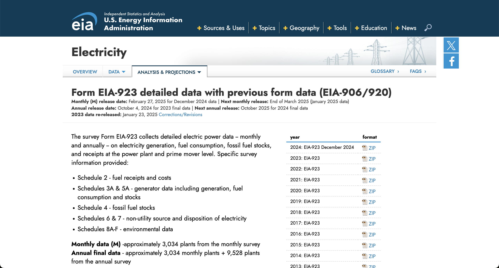

:::::::::::::::::::::::::::::::::::::: questions

- How do I avoid the tedium/error-prone-ness of clicking lots of links or making lots of API requests by hand?

::::::::::::::::::::::::::::::::::::::::::::::::

::::::::::::::::::::::::::::::::::::: objectives

- Use pagination to get all available data
- Automatically download files from a long listing of links on a page

::::::::::::::::::::::::::::::::::::::::::::::::

## Introduction

Now we've learned about how to download data from websites and from APIs. But some questions linger...

* you might remember seeing that 'warning' from the EIA API about only returning 5000 rows at a time... how can we get more?

* often there are webpages with lots of links to data you want... copy-pasting each link into our code is a pain, and hardly better than just clicking each link to download the data. Is there a better way?

The thread connecting these two questions/problems is that sometimes your data lives behind *many* URLs, not just one.

## Web scraping

Let's start by downloading files from a webpage that has many links - the good old EIA website.

For all the benefits of the API, some of the EIA 923 data is only available through the downloadable spreadsheets - and the spreadsheets are only available by clicking through the list of links on the EIA 923 page:

{alt="Screenshot of the EIA 923 data page. A listing of each year's files is in the right sidebar."}

There's only a couple dozen, so we could probably get away with just downloading the files by clicking. 

You can imagine how this would be annoying if you needed to download, say, a hundred files instead. To keep things simple we'll use the EIA data as an example.

### Example: EIA 923

To get the links, first we need to actually get the webpage that the links are on.

```python
import requests

url = "https://www.eia.gov/electricity/data/eia923/"
response = requests.get(url)

response.text
```

```output
'<!doctype html>\r\n<html>\r\n\r\n<head>\r\n\t<title>\r\n\t\tForm EIA-923 detailed data with previous form data (EIA-906/920) -\r\n\t\tU.S. Energy Information Administration (EIA)\t</title>\r\n\t<meta property="og:title" content="Form EIA-923 detailed data with previous form data (EIA-906/920) - U.S. Energy Information Administration (EIA)">\r\n\t<meta property="og:url" content="https://www.eia.gov/electricity/data/eia923/index.php">\r\n\t<meta name="url" content="https://www.eia.gov/electricity/data/eia923/index.php">\r\n\t<meta name="description" content="Clean Air Act Data Browser" />\r\n\t...
```

OK, so that looks like some XML, which we saw a couple episodes ago. We don't expect a *data table*, though - more a jumble of links. We need to use a different tool to make sense of all this - a library called `beautifulsoup`. For historical reasons it's imported as `bs4`.

```python
import bs4
soup = bs4.BeautifulSoup(response.text)

soup
```

The first thing you'll notice is that the output looks neater:
```output
<!DOCTYPE html>
<html>
<head>
<title>
		Form EIA-923 detailed data with previous form data (EIA-906/920) -
		U.S. Energy Information Administration (EIA)	</title>
<meta content="Form EIA-923 detailed data with previous form data (EIA-906/920) - U.S. Energy Information Administration (EIA)" property="og:title"/>
```

More importantly, we'll be able to filter through this complicated set of tags.

```python
soup.find_all("title")
```

To get all the links, we need to get all the `a` tags:

```python
soup.find_all("a")
```

```output
[<a name="top"></a>,
 <a href="http://x.com/eiagov/" target="_blank"><span class="ico-sticker twitter"></span></a>,
 <a class="addthis_button_tweet"></a>,
 <a href="https://www.facebook.com/eiagov" target="_blank"><span class="ico-sticker facebook"></span></a>,
 <a class="addthis_button_facebook_like at300b" fb:like:layout="button_count"></a>,
 ...
 <a class="ico zip" href="xls/f923_2024.zip" title="2024"><span>ZIP</span></a>,
 <a class="ico zip" href="archive/xls/f923_2023.zip" title="2023"><span>ZIP</span></a>,
 <a class="ico zip" href="archive/xls/f923_2022.zip" title="2022"><span>ZIP</span></a>,
 <a class="ico zip" href="archive/xls/f923_2021.zip" title="2021"><span>ZIP</span></a>,
 <a class="ico zip" href="archive/xls/f923_2020.zip" title="2020"><span>ZIP</span></a>,
 ...
```

OK, so we see a big list of tags, some of which appear to be links to form 923 ZIP files. The URLs for those are included in an `href` attribute. The world of HTML is vast and chaotic, but almost every URL you'll want to use will live in one of these `href` attributes (it stands for "hypertext reference" if that helps you remember).

We can filter based on attributes like this:

```python
soup.find_all("a", href=True)
```

This shows us only the `a` tags with `href`s defined:

```output
[<a href="http://x.com/eiagov/" target="_blank"><span class="ico-sticker twitter"></span></a>,
 <a href="https://www.facebook.com/eiagov" target="_blank"><span class="ico-sticker facebook"></span></a>,
 <a class="eia-accessibility" href="#page-sub-nav">Skip to sub-navigation</a>,
 <a class="logo" href="/">
 <h1>U.S. Energy Information Administration - EIA - Independent Statistics and Analysis</h1>
 </a>,
 <a class="nav-primary-item-link menu-toggle" href="javascript:;">
```

And then you can filter those only for the ones that point at actual ZIP files:

```python
a_with_zip = [a for a in a_with_href if "zip" in a["href"].lower()]
a_with_zip
```

```output
[<a class="ico zip" href="xls/f923_2024.zip" title="2024"><span>ZIP</span></a>,
 <a class="ico zip" href="archive/xls/f923_2023.zip" title="2023"><span>ZIP</span></a>,
 <a class="ico zip" href="archive/xls/f923_2022.zip" title="2022"><span>ZIP</span></a>,
 <a class="ico zip" href="archive/xls/f923_2021.zip" title="2021"><span>ZIP</span></a>,
 <a class="ico zip" href="archive/xls/f923_2020.zip" title="2020"><span>ZIP</span></a>,
 <a class="ico zip" href="archive/xls/f923_2019.zip" title="2019"><span>ZIP</span></a>,
 <a class="ico zip" href="archive/xls/f923_2018.zip" title="2018"><span>ZIP</span></a>,
 <a class="ico zip" href="archive/xls/f923_2017.zip" title="2017"><span>ZIP</span></a>,
 <a class="ico zip" href="archive/xls/f923_2016.zip" title="2016"><span>ZIP</span></a>,
 <a class="ico zip" href="archive/xls/f923_2015.zip" title="2015"><span>ZIP</span></a>,
 <a class="ico zip" href="archive/xls/f923_2014.zip" title="2014"><span>ZIP</span></a>,
 <a class="ico zip" href="archive/xls/f923_2013.zip" title="2013"><span>ZIP</span></a>,
 <a class="ico zip" href="archive/xls/f923_2012.zip" title="2012"><span>ZIP</span></a>,
 <a class="ico zip" href="archive/xls/f923_2011.zip" title="2011"><span>ZIP</span></a>,
 <a class="ico zip" href="archive/xls/f923_2010.zip" title="2010"><span>ZIP</span></a>,
 <a class="ico zip" href="archive/xls/f923_2009.zip" title="2009"><span>ZIP</span></a>,
 <a class="ico zip" href="archive/xls/f923_2008.zip" title="2008"><span>ZIP</span></a>,
 <a class="ico zip" href="archive/xls/f906920_2007.zip" title="2007"><span>ZIP</span></a>,
 <a class="ico zip" href="archive/xls/f906920_2006.zip" title="2006"><span>ZIP</span></a>,
 <a class="ico zip" href="archive/xls/f906920_2005.zip" title="2005"><span>ZIP</span></a>,
 <a class="ico zip" href="archive/xls/f906920_2004.zip" title="2004"><span>ZIP</span></a>,
 <a class="ico zip" href="archive/xls/f906920_2003.zip" title="2003"><span>ZIP</span></a>,
 <a class="ico zip" href="archive/xls/f906920_2002.zip" title="2002"><span>ZIP</span></a>,
 <a class="ico zip" href="archive/xls/f906920_2001.zip" title="2001"><span>ZIP</span></a>,
 <a class="ico zip" href="archive/xls/f906nonutil2000.zip" title="2000"><span>ZIP</span></a>,
 <a class="ico zip" href="archive/xls/f906nonutil1999.zip" title="1999"><span>ZIP</span></a>,
 <a class="ico zip" href="archive/xls/f906nonutil1989.zip" title="1989-1998"><span>ZIP</span></a>]
```

That looks about right - maybe we want to skip those non-utility links at the bottom as well.


```python
eia_923_906s = [a for a in a_with_zip if "nonutil" not in a["href"].lower()]
eia_923_906s
```

OK, now we have our links.

In the end we'd love to have some sort of dictionary that maps the filename to a URL we can pass in to `requests.get`... something like:

```python
links = {"eia923_2010": "https://www.eia.gov/...", ...}

for name, url in links.items():
    response = requests.get(url)
    # ... write the file to disk somewhere
```

To get there, we'll need to:
* clean up the URL
* generate a nice name for each file
* actually download the file to disk

Let's start by cleaning up the URLs. You may have noticed that the `href`s don't include the whole link.

If you "copy link address" from the website for the 2024 data, you see: `https://www.eia.gov/electricity/data/eia923/xls/f923_2024.zip`. But the `a` tag only has `xls/f923_2024.zip`. That's because the `href` can be a relative path, much like the relative paths we ran into in episode 2.


Exercise:
Get historical 906 data

https://www.eia.gov/electricity/data/eia923/eia906u.php

```
import bs4


def get_spreadsheet_links(soup) -> list[url]:
    ...

def main():
    soup = bs4...
    links = get_spreadsheet_links(soup)
    for link in links:
        request.get(...)

```

:::: discussion

Why else might you choose to do this instead of just manually collecting links?

* If there are lots of links to download
* If it's a lot of effort to get to each link
* If the data is frequently updated
* If I have to download all the files multiple times

::::

### pagination

Motivation: API only returns 5k rows at a time. You want MORE.

Example:

One single limit/offset request - get 10 rows, then show how you can get that as 2 sets of 5 rows instead.

Exercise:
Grab *all* of one specific facet.

Basically - this would be a fill in the blank / complete the code exercise - we have most of the loop body

```python
# get first page
# get total row count
# pre-calculate how many pages there are
all_records = []
for ______:
    # params missing limit & offset
    page_of_data = requests.get("...", params={}).json()
    all_records.append(page_of_data["response"]["data"])
```

### Further resources

Motivate: sometimes this won't be enough.

* inspect html structure
* javascript
* user agents
* network tab


::::::::::::::::::::::::::::::::::::: keypoints

- beautiful soup lets you grab links out of a webpage so that you can then download them
- ... pagination?

::::::::::::::::::::::::::::::::::::::::::::::::
