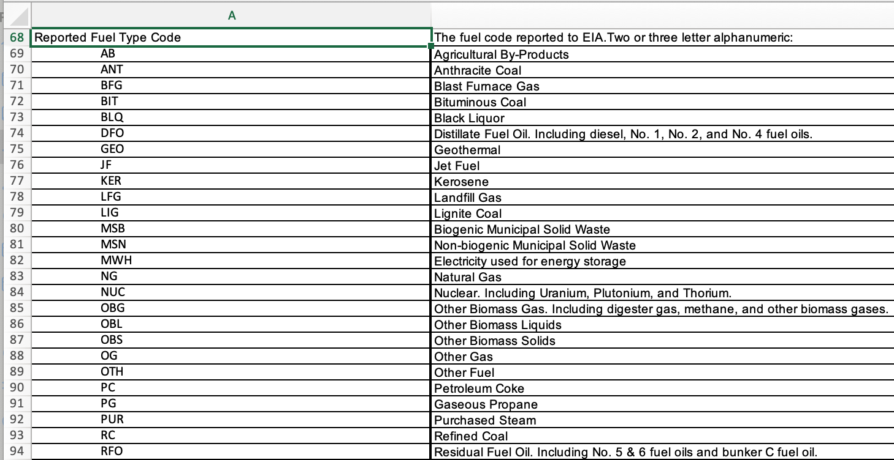

:::::::::::::::::::::::::::::::::::::: questions

- How do I get ready to do research with data that is new to me?
- What should I do when I find something that doesn't look right?
- How can I get a head start on identifying data problems that might cause headaches later?

::::::::::::::::::::::::::::::::::::::::::::::::

::::::::::::::::::::::::::::::::::::: objectives

- Use divide-and-conquer to split a table into manageable pieces
- Examine data for anomalies using summarization and visualization
- Articulate the difference between refining plots for exploration and refining plots for presentation
- Execute strategies for locating the cause and extent of anomalies

::::::::::::::::::::::::::::::::::::::::::::::::

Now that you have some raw data, how do you get from there to actually doing research with it?

Maybe you already have a research question;
how do you get your data into a form that can help you answer it?
How do you know your data doesn't have gremlins hiding in it that will mess up your research?

In this session we will do some initial data explorations and develop strategies for identifying and diagnosing sneaky data problems
-- including the use of data visualization as part of your exploration toolkit.
Plots aren't just for papers!

# What kinds of data problems are common in energy data?

Data problems come in many different forms, and how you respond to them will depend on the source of the problem and what kind of impact it will have on the kinds of modeling and analysis you want to do.

* **Problems introduced by the respondent** - typos and other data entry errors - These can be fixed if they're simple, or can be a reason to exclude certain rows if correct values can't be reconstructed.
* **Problems introduced by the data aggregator** - disagreement between documentation you received and the actual forms filled out by respondents; a bad choice of data format that doesn't preserve relationships within the data - These can sometimes be "fixed" by working out logically what the definition of a column should actually be, but sometimes not.
* **"Problems" introduced by external forces** - natural disasters, policy change - These may be retained or excluded depending on your exact area of research.
* **Problems we created for ourselves** - We'll talk about this in a later session.

Data problems can occur in a single column, or in the relationship between columns, or even in the relationship between tables.

# What is a good general strategy for finding problems in unfamiliar data?

Data problems aren't always obvious. To uncover them, we will need to go looking for them.

There is a pattern to this:

* Carve off a chunk of data small enough to reason about
* Identify what we expect to see from that data
* Compare with what we actually see
* Justify or explain any differences between what we expect and what is actually there

When we first start out, our expectations will be quite general, often based on data type -- whether the data is numeric, categorical, or free text.
As we become more familiar with the data, our expectations will become more sophisticated.

# Put it into practice

Let's take a look at how these ideas apply to real data.

We're looking at form EIA-923, which covers electricity generation and fuel consumption by plant and prime mover on a monthly and annual basis.

You have one raw file for EIA-923 data from Puerto Rico, and two processed files which were prepared by your predecessor:

```python
raw_file = "../data/raw_eia923__puerto_rico_generation_fuel.parquet"
annual_file = "../data/pr_gen_fuel_annual.parquet"
monthly_file = "../data/pr_gen_fuel_monthly.parquet"
```

(They also left you their source code, but we'll start with the data and take a look at the code in another session.
Reading the code will be easier if we are more familiar with the data.)

We will ask ourselves:

* What kinds of data are there? Can I look at just one kind at a time?
* What do I expect to see from this data?
* What do I actually see?
* Can I justify or explain any differences between what I expect and what I actually see?

## Annual data

We'll start with the annual file.

```python
import pandas as pd
pr_gen_fuel_annual = pd.read_parquet(annual_file)
pr_gen_fuel_annual
```

Our predecessor has already taken care of a lot of the cleaning necessary for this data, so it's already in usable condition, with nice specific data types and a tidy arrangement of columns.
<!--  -- we'll dig into their pipeline for that in a later session, but it covered setting appropriate data types, splitting annual data from monthly data, and pivoting the monthly data from a wide to a tidy narrow format. -->

We want to focus on uncovering problems that didn't show up during cleaning.

There are 24 columns here, which is a little much to reason about all at once.
One way to tackle a problem that seems too large is to break it up into smaller pieces.
There are lots of ways to split up a wide table, and they'll all work well enough to get you started:

* Split up columns by purpose
  * Primary key columns: the columns that uniquely identify each row of data; closely related to what each row represents
  * Timeseries columns: the independent and dependent variables you would plot in a line chart
  * Grouping columns: the columns you could use to group data together and see if different groups have different properties
* Split up columns by data type
  * Numeric data
  * Categorical data
    * Identifiers
    * Codes
    * True/false ("booleans")
  * Free text data

Generally, splitting up columns by purpose requires more domain knowledge,
but can also help you understand the meaning of the data more quickly than looking just based on data type.
We'll use a little of both so you can see what they're like.

### Primary keys & index columns

Let's start with a primary key.
What columns, taken together, have unique values from row to row?
What does each row in this file represent?

```python
# 1. carve off a chunk: what is the primary key?
```

If we were familiar with EIA 923 from other research, we might know that already.
If not, we can check the dataset documentation.
The grandfather of this dataframe is an Excel file, which has some documentation we can look at.

If you want to follow along, you can find the file `eia923_pr.xlsx` in the `data` directory of the lesson repo.

{alt="Excel screenshot showing tab Page 7 File Layout of file data/eia923_pr.xlsx.
A table titled Generation and Fuel Data has two columns, Data Elements and Description.
The first few rows are visible; contents as follows.
Plant ID: EIA Plant Identification number. One to five digit numeric.
Combined Heat & Power Plant: Whether or not the plant is a combined heat & power facility (cogenerator). One character alphanumeric, Y or N.
Nuclear Unit ID: For nuclear plants only, the unit number. One digit numeric. Nuclear plants are the only type of plants for which data are shown explicitly at the generating unit level.
Plant Name: Plant name. Alphanumeric.
Operator Name: The name of the entity which operates the plant. Alphanumeric.
Operator ID: The EIA operator identification number. Five digit numeric, padded with leading zeros.
State: State the facility is located in. Two character alphanumeric (standard state postal codes)."}

The documentation doesn't say what uniquely identifies each entry; we will have to reason it out.
We know each plant has to file with the EIA every year, so we'll use that as our initial guess:

* Plant ID
* Year

Let's check.
If that's the primary key, then we expect each pair of (plant ID, year) values to only occur once in the data frame.
`.value_counts()` will tell us the number of times each distinct row occurs in a data frame.
If we select only the primary key columns, then it will tell us how many times each primary key value occurs.
If there are no values that occur more than once, or few enough that we could believe they were mistakes, then we got it.

```python
# 1. carve off a chunk: what is the primary key?
primary_key_columns = ["plant_id_eia", "report_year"]
# 2. what do we expect: every pk value occurs no more than once
pr_gen_fuel_annual[primary_key_columns].value_counts()
```

There are 283 rows in the result, so there are 283 primary key values available.
Oh dear there are some that occur five or six times.
How common is that?
For easier readability we can add the plant name in.

```python
primary_key_columns = ["plant_id_eia", "plant_name_eia", "report_year"]
# 2. what do we expect: every pk value occurs no more than once
pr_gen_fuel_annual[primary_key_columns].value_counts()
```

And then filter for just the ones with multiple rows.

```python
primary_key_columns = ["plant_id_eia", "plant_name_eia", "report_year"]
# 2. what do we expect: every pk value occurs no more than once
pk_sizes = pr_gen_fuel_annual[primary_key_columns].value_counts()
pk_sizes.loc[pk_sizes>1]
```

Ninety one! Out of 283.
That's almost a third.
We might expect a few errors but a third is too many;
it's more likely we're wrong about the primary key.
Let's look at one example.

```python
# 3. what did we find: 1/3 occur more than once
# 4. explain why: try an example
pr_gen_fuel_annual.loc[
    (pr_gen_fuel_annual.plant_id_eia == 66127) &
    (pr_gen_fuel_annual.report_year == 2022)
].transpose()
```

Looks like these two records differ in `energy_source_code`.
Let's add that in, and see if our revised expectation holds true.

```python
# 4. explain why: we were missing energy_source_code
primary_key_columns = ["plant_id_eia", "plant_name_eia", "report_year", "energy_source_code"]
# 2. what we expect: no more than once
pk_sizes = pr_gen_fuel_annual[primary_key_columns].value_counts()
pk_sizes.loc[pk_sizes>1]
```

Better, but we still have a lot of duplicates.

::: challenge

Look at one of the duplicate entries and propose another column to add to our primary key.

:::: solution

If we add `prime_mover_code` to our primary key, we end up with only one duplicate entry.


```python
primary_key_columns = [
    'plant_id_eia', 'plant_name_eia', 'report_year', 'energy_source_code', 'prime_mover_code'
]
# 3. what we found: one duplicate
pk_sizes = pr_gen_fuel_annual[primary_key_columns].value_counts()
pk_sizes.loc[pk_sizes>1]
```

```output
plant_id_eia  plant_name_eia            report_year  prime_mover_code  energy_source_code
62410         Cervecera de Puerto Rico  2020         IC                DFO                   2
dtype: int64
```

::::

:::

Only one!
That's plausibly a respondent error or data entry problem.

```python
# 4. explain why: likely respondent error or data entry problem
```

We can note that plant down as a possible troublemaker to investigate later.

It's a good idea to keep notes on the problems you find,
or little bits that look suspicious but would take away from your primary focus if you chased them immediately.
Let's do that now.
We'll open up a new document, and make a note of what we found.

```text
# Problems in EIA-923 Puerto Rico data

Primary key occurs twice:
    plant_id_eia  plant_name_eia            report_year  prime_mover_code  energy_source_code
    62410         Cervecera de Puerto Rico  2020         IC                DFO                   2
    dtype: int64
```

But we have our primary key!
That's five columns we've carved off of the original 24, using the "split columns by purpose" strategy.
We wound up needing a combination of domain knowledge from the documentation, and empirical knowledge gained by guess-and-check.

Using this approach, we found one duplicate entry that could mess up our analysis later.

Next let's take a look at an example of the "split columns by data type" strategy.

### Splitting columns by data type

Let's think about how data type affects what we expect to see.

* **Numeric data** might be in whole numbers (1, 2, -11, 56,912) or use decimal fractions (3.14, 0.000123, -65,536.2).
  In programming, a whole number is often called an "integer" or "int" while a number with a decimal fraction is often called a "float"
  (short for "floating point", which has to do with minutiae of how fractions are implemented in binary -- we don't need to know the details for this course)
* **Categorical data** takes on one of a restricted set of available values.
  They might be ID numbers, an alphanumeric string, a few words, or a few letters meant to abbreviate a longer category name.
  If a value appears that is not in the restricted set, that value is invalid, and likely resulted from a typo or similar error.
  An explanation of all the available values for each categorical column is usually included in the documentation for a data source,
  but sometimes you can get a rough idea from context.
* **Free text data** [which we won't cover today] is unrestricted, except perhaps in length.
  It might be a description of an incident, location, or piece of equipment.
  A free text value is not required to match any other entry or registry, and there's usually no such thing as an invalid value.
  Free text typically requires the application of qualitative research methods before it can be analyzed further.
  Unfortunately, in energy data it is common for things like plant names to be entered as free text -- meaning you have to cope with a variety of spelling and abbreviation choices when trying to match between data sets.

<!--
All data types need to deal with situations where no value is available for that entry.
In pandas, we usually encode an intentionally missing value as `NA`.
Elsewhere in Python, we use `None`.
Other programming languages, software, and systems may make different choices.
Often, one of the first things to do when getting a new data set ready for research is to figure out how missing data was encoded by the data source, and map that to how *you* plan to encode missing data.
 -->

We can use `.dtypes` to show the data type of each column.

```python
pr_gen_fuel_annual.dtypes
```

### Categorical data

We'll start with categorical data.

Some of the columns have already been labeled as having pandas data type `category`.
That's a pandas dtype that automatically restricts the set of values the column is allowed to take.
We can examine one of the dtypes directly to see the available values for that column:

```python
pr_gen_fuel_annual.dtypes["energy_source_code"]
```

```output
CategoricalDtype(categories=['BIT', 'DFO', 'MWH', 'NG', 'RFO', 'SUN', 'WAT', 'WND'], ordered=False, categories_dtype=object)
```

We can glean a little information just from context here -- this is an energy source code,
and it looks like it's a 2- or 3-letter abbreviation for where the energy came from.
NG could be natural gas; SUN feels likely for solar, WAT for hydro, WND for wind.
BIT may be familiar if you're from anywhere in Appalachia, for bituminous coal.
DFO and RFO are a mystery to me, but codes like this should be defined in the documentation for each dataset.
Let's look in the EIA 923 documentation to see what the others are.

{alt="Excel screenshot showing rows 68-94 of tab Page 7 File Layout of data/eia923_pr.xlsx.
Row 68 contains the title: Reported Fuel Type Code; and description: The fuel code reported to EIA, two or three letter alphanumeric.
There are rows for BIT (bituminous coal), DFO (distillate Fuel Oil including diesel, number 1, number 2, and number 4 fuel oils), NG (natural gas), and RFO (residual fuel oil, including number 5 and 6 fuel oils and bunker c fuel oil)."}

Under Reported Fuel Type Code, there are a lot more options than we have in the pandas dtype,
but that's okay so long as all the options we *do* have in the pandas dtype are listed -- and they are.
DFO is distillate fuel oil (like diesel), and RFO is residual fuel oil.

::: challenge

Look at `reporting_frequency_code`, which is another column with the `category` dtype.
Use the column name, the available values, and the EIA 923 documentation to get a rough idea of what the category means.

:::: solution

The `reporting_frequency_code` column has 3 available values:

```python
pr_gen_fuel_annual.dtypes["reporting_frequency_code"]
```

```output
CategoricalDtype(categories=['A', 'AM', 'M'], ordered=False, categories_dtype=object)
```

The documentation says these indicate respondents that file annually with only annual totals, respondents that file annually with both annual and monthly data, and respondents that file monthly data each month.

::::

:::

Great! Now we know how to start making sense of columns with the `category` dtype.

To go deeper, let's collect all the category columns together so we can analyse them all at the same time.

```python
# 1. carve off a chunk: what columns contain categorical data?
category_columns = list(
    pr_gen_fuel_annual.dtypes[
        (pr_gen_fuel_annual.dtypes == "category")
    ].index
)
category_columns
```

We can use `.describe()` to show some basic information about category data.

```python
pr_gen_fuel_annual[category_columns].describe()
```

Let's look at `energy_source_code` as an example:

```output
energy_source_code	fuel_type_code_agg	fuel_unit	plant_state	prime_mover_code	reporting_frequency_code	data_maturity
count	450	450	319	450	450	349	450
unique	8	8	4	1	9	3	2
top	DFO	DFO	barrels	PR	PV	M	final
freq	188	188	237	450	99	181	417
```

* `count` shows us how many rows have a value set. If it's equal to the total number of rows, you know you have no nulls. Looks like there aren't any nulls in the in the energy source code, which is good.
* `unique` shows us how many unique values are in each column. We already kinda know this from looking at the category dtype object, but it's nice to have confirmation that this data includes 8 different energy source codes.
* `top` shows us the most common value in each column, and `freq` shows how many times that value appeared. Looks like a third to half of the rows have an energy source code of DFO.

We can apply our strategy here too:

```python
# 2. what do we expect?
# - count: no nulls*
# - unique: matches category dtype count, ~matches documentation
# - top&freq: plausible
```

To go even further, we can look at the frequency table for `energy_source_code` using `.value_counts()`:

```python
pr_gen_fuel_annual.energy_source_code.value_counts()
```

```output
energy_source_code
DFO    188
SUN     99
NG      49
RFO     49
MWH     24
WND     17
WAT     15
BIT      9
Name: count, dtype: int64
```

This builds up our domain knowledge and gives us a more detailed picture of the energy landscape in Puerto Rico:

- Lots of oil
- Solar is surprisingly common
- Wind and hydro less so
- Very few coal entries. Is this expected? Not sure.

-- but keep in mind, this is going purely by the number of EIA-923 entries, and not by the actual fuel mix of the grid.
We'll make a note of the two surprises -- lots of solar and little coal -- in our notebook, in case we want to come back to it later.

```text
Energy source code frequency table:
    energy_source_code
    DFO    188
    SUN     99
    NG      49
    RFO     49
    MWH     24
    WND     17
    WAT     15
    BIT      9
    Name: count, dtype: int64
Why so much solar?
Why so little coal?
```

:::: challenge

Your turn: Examine the `.describe()` output for the other category columns.
Use the File Layout documentation and `.value_counts()` to verify whether the `reporting_frequency_code` and `fuel_unit` columns make sense or not.

:::::: solution

```python
pr_gen_fuel_annual.reporting_frequency_code.describe()
```

`reporting_frequency_code` looks good; the File Layout documentation says there are three options, and we see three unique values here.
There are some nulls though.
Something to keep an eye on if we end up needing this column for something later.

Let's make a note of what we found:

```text
- reporting_frequency_code has a bunch of nulls; will this matter? ~100/450
```

```python
pr_gen_fuel_annual.fuel_unit.describe()
```

`fuel_unit` looks off, since File Layout says there should be three values but `.describe()` found four. Let's look closer:

```python
# 4. why are there 4 fuel units when the docs say there should only be three?
pr_gen_fuel_annual.fuel_unit.value_counts()
```

```output
fuel_unit
barrels          237
mcf               49
megawatthours     24
short tons         9
Name: count, dtype: Int64
```

Huh. `megawatthours` is not a valid physical unit, according to the documentation... but it's definitely not a typo.
How is this being used in the data?

We can filter for just the rows that use `megawatthours` in the `fuel_unit` column:

```python
pr_gen_fuel_annual.loc[pr_gen_fuel_annual.fuel_unit == "megawatthours", category_columns].describe()
```

We can eyeball the whole dataframe looking for patterns, or we can use `.describe()` to help us know for sure whether each column has multiple values or only one.

* `energy_source_code` is MWH, which intuitively matches the unit but isn't particularly illuminating
* `fuel_type_code_agg` is OTH, probably for "Other"; no help there
* `prime_mover_code` is BA, which is worth looking up. "Energy Storage, Battery" -- looks like at least some of the PR respondents report generation from batteries using a fuel unit, which isn't expected by the EIA, but they're consistent about it, which is nice.

Better write that down too:

```text
- fuel_unit includes "megawatthours" for BA (=battery) prime movers
```

::::::

::::

We've split off 7 of the 24 columns using the "split by data type" strategy to look at category data.
Using this approach, we found some null values we'll need to handle carefully if we need those columns for our research,
and we found one off-spec-but-ultimately-reasonable rogue value for `fuel_unit` that could have tripped us up if we were relying on the documentation alone.

### Numeric data

But we're here for *visual* data exploration!
Let's look at some data we can plot.

```python
pr_gen_fuel_annual.dtypes
pr_gen_fuel_annual.drop(columns=category_columns).dtypes
```

While the categorical data was pretty much limited to one dtype, the numeric data is divided up between `float64` and `Int64`.
The columns with `float64` dtype, like `elec_fuel_consumption_mmbtu`, can contain decimal fractions,
while the columns with `Int64` dtype, like `report_year`, contain only whole numbers.
Some datasets may use integers to store whole-number measurements such as counts.
In this dataset, all of the measurements are continuous.
If we want to plot measurement data, we want to look at the float columns.

```python
# 1. carve off a chunk: float columns for measurement data
measurement_columns = list(
    pr_gen_fuel_annual.dtypes[
        (pr_gen_fuel_annual.dtypes == "float64")
    ].index
)
measurement_columns
```

When we were looking at categorical string data, we used `.describe()` to show a summary that helped us determine whether the data was reasonable or not.
We can use `.describe()` on numeric data, too!

```python
pr_gen_fuel_annual[measurement_columns].describe()
```

For numeric data, `.describe()` gives us statistics for each column.

* `count` is the same as with string data: it shows us how many rows have a value set. For all of these numeric columns, it is equal to the total number of rows, so we know we have no nulls.
* `mean` is the average. If one of these showed a wildly unexpected scale, or large negative, we would know something was weird, but these all look plausible.
* `std` is the standard deviation, which tells you how spread out the values are in each column.
* `min`, `25%` `50%` `75%` (quartiles), `max` give a rough idea of how the data are distributed. We have some negatives in `total_net_generation_mwh`, but negatives do show up sometimes in netgen, and negative 3,000 on a maximum of 3,000,000 is reasonable.

```python
# what do we expect?
# - count: no/few nulls
# - mean&std: plausible scale; plausible sign
# - quartiles: plausible scale; plausible sign
```

This is where we can start looking at the relationship between columns to see if problems are hiding there.

We've got two pairs of mmbtu+quantity variables.
Since they're measuring in different units,
we don't expect their values to match,
but we do kinda expect them to have the same shape.
But it looks like the `_quantity` variables have a lot more zeros in them.
Let's look closer with a histogram:

```python
# what did we find? quantity has more zeros than mmbtus. why?
elec_fuel_consumption_cols = ["elec_fuel_consumption_mmbtu","electric_fuel_consumption_quantity"]
elec_fuel_consumption = pr_gen_fuel_annual[elec_fuel_consumption_cols]
elec_fuel_consumption.hist()
```

The first thing it prints out is this array of Axes.
There is one for each column we plotted.
We'll talk more about Axes in a little bit.

The next thing is shows is the histogram.
There are a few things preventing this graph from telling us what we want to know.
A histogram has the value on the x axis and the frequency of that value / range of values on the y axis.
These two plots have different y axes, which makes it difficult to see that the zero bin has a different frequency for mmbtus on the left than for quantity on the right.
We can fix that with `sharey`.

```python
elec_fuel_consumption_cols = ["elec_fuel_consumption_mmbtu","electric_fuel_consumption_quantity"]
elec_fuel_consumption = pr_gen_fuel_annual[elec_fuel_consumption_cols]
elec_fuel_consumption.hist(sharey=True)
```

Now we can see that zeros are much more common on the right.
Next let's make use of this empty space to the right of the plot.
The default plot width is quite narrow.
To widen it, we will use the following incantation:

```python
import matplotlib.pyplot as plt
plt.rcParams['figure.figsize'] = [10, 4]
```

This sets the default figure size to 10 inches wide and 4 inches tall.
You can put in whatever size makes sense for your monitor.
This works because pandas uses matplotlib under the hood to make its plots.
When we change the settings for matplotlib, it affects pandas' plotting.

Back to our question: why does `_quantity` have so many more zeros than `_mmbtu`?

The easiest explanation would be if one of our categorical variables could identify a group that behaved wildly differently in `_quantity` than it did in `_mmbtu`.

Let's check one categorical variable together.

We can use a for loop to plot each group from `data_maturity`:

```python
# why does quantity have more zeros than mmbtu?
for gr, df in pr_gen_fuel_annual.groupby("data_maturity"):
    axs = df.hist(column=elec_fuel_consumption_cols, sharey=True)
```

That gave us one row for each value of `data_maturity`, but it hasn't told us which value goes with which row.
That's confusing.
Let's add some labels using the `legend()` function:

```python
for gr, df in pr_gen_fuel_annual.groupby("data_maturity"):
    axs = df.hist(column=elec_fuel_consumption_cols, sharey=True)
    axs[-1][-1].legend([f"data_maturity: {gr}"])
```

Okay, so the first row is for `data_maturity` final and the second row is for `data_maturity` incremental-ytd.
These show some slight differences, particularly for the incremental-ytd group, but nothing overwhelmingly convincing.
Ideally we would want to see a group that had some nonzero bins for `mmbtu`, but only the zero bin for `quantity`.
We can mark `data_maturity` as a "maybe" for helping explain our question.

Let's take a moment and review the process we just used for exploratory data visualization:

First, we decided we wanted to see a histogram comparing quantity and mmbtus split out by each category in the `data_maturity` column.

Next, we wrote code to get pandas/matplotlib to show it to us.

In our first try, it was too hard to tell which set of histograms went with which category.
So, we added some code to label each pair of histograms.
They're not pretty labels, but they were enough to clarify what we were looking at.

Finally, we evaluated the plots and determined that `data_maturity` doesn't explain why quantity has more zeros than mmbtus.

:::: challenge

Now it's your turn.
Find a categorical column that seems to explain why there are so many more zeros in `quantity` than in `mmbtu`.

:::::::: solution

```python
for gr, df in pr_gen_fuel_annual.groupby("energy_source_code"):
    axs = df.hist(column=elec_fuel_consumption_cols, sharey=True)
    axs[-1][-1].legend([gr])
```

* SUN, WAT, and WND _always_ have zero `quantity`.
  You can kinda guess from the codes themselves, or look them up in the File Layout documentation ("Reported Fuel Type Code"), but these are the energy source codes for solar (SUN), hydro (WAT), and wind (WND) power.
  Which kinda makes sense, if we're trying to measure a "quantity of fuel consumed".
  How many units of sun did we burn today at the power plant?
  How about wind? ... water?
  It doesn't explain why `mmbtu` for renewables is nonzero, but it's something!
* Bonus confidence: the other energy source codes have _excellent_ matching between `quantity` and `mmbtu`.
* Bonus puzzle: MWH always has zero `mmbtu`! How odd.

Honorable mentions:

* `prime_mover` shows moderate differences for BA, CT, and ST as well as the overwhelming differences for HY, PV, and WT.
  If you're a little more endowed with domain knowledge (or handy with the File Layout documentation, "Reported Primer[sic] Mover") you may notice that these are the prime mover codes for hydro (HY), photovoltaic (PV), and wind turbines (WT), which line up exactly with the WAT, SUN, and WND energy source codes.
  The only reason this wasn't my top choice for the solution is because this dataset covers 8 energy source codes and 9 prime mover codes.
* `fuel_unit` shows suspicious differences for megawatthours, though it's in the opposite direction
* `reporting_frequency_code` shows suspicious differences for AM, but that only covers ~10 respondents, and our discrepancy is more like 50.

Alternate approach: use boxplots

```python
axs=pr_gen_fuel_annual.groupby("energy_source_code")[elec_fuel_consumption_cols].plot.box(
    label="energy_source_code")
for i, ax in zip(axs.index, axs.values):
    ax.legend([i])
```

::::::::

::::

So now we know to stick to mmbtus if we want to capture renewables.
That's definitely something to write down for future-us:

```text
- fuel consumption columns
  _ *_quantity is always zero for renewables (SUN, WAT, & WND energy source codes) -- use *_mmbtu instead
  - *_mmbtu is always zero for MWH energy source code -- use *_quantity instead? :(
```

Splitting off the numerical measurement data got us through another 5 columns.
Using this approach, we found out that renewables are handled oddly in the `fuel_consumption` columns:
For solar, wind, and hydro, all the useful data are in `_mmbtu`, and for battery storage, they're all in `_quantity`.
If our research relies on fuel consumption figures, we'll need to either exclude renewables from our analyses, or treat them separately.

The remaining 9 columns are:

- 1 boolean column (honorary categorical)
- 3 object columns (all nulls)
- 3 Int64 columns (all identifiers)
- 2 string columns (all names) (you can analyse these the same way as categoricals, using `.describe()` and `.value_counts()`)

We got through a 24-column table of annual data from EIA 923 in Puerto Rico, and we know something about the primary key columns, category columns, and numeric measurement columns.
That's a significant step in getting familiar with this dataset!

## Little break!

## Monthly data

Now let's look at the monthly data.

```python
pr_gen_fuel_monthly = pd.read_parquet(monthly_file)
pr_gen_fuel_monthly
pr_gen_fuel_monthly.dtypes
```

We have some familiar friends:

- Plant ID & plant name
- Prime mover code
- Energy source code
- Fuel unit

We have a new `date` column with dtype `datetime64`. What's that about?

```python
pr_gen_fuel_monthly.date
```

Looks suspiciously like the first of the month. Is it always like that? We can verify using `.value_counts()`.

```python
pr_gen_fuel_monthly.date.value_counts().sort_index()
```

```output
date
2017-01-01    35
2017-02-01    35
2017-03-01    35
2017-04-01    35
2017-05-01    35
              ..
2024-10-01    33
2024-11-01    33
2024-12-01    33
2025-01-01    33
2025-02-01    33
Name: count, Length: 98, dtype: int64
```

Most of the remaining variables are time series.
Time series data lends itself to plotting especially well.

Most people are familiar with putting plots in reports, research papers, and presentation slides, where they're useful as evidence supporting your argument.
To be effective, those plots need to -- essentially -- look nice:
clear labels and titles,
appropriate units and limits,
good color separation for print or screen,
tidy legends,
minimizing extraneous data.
The goal is to communicate your point.

When you're in the exploratory phase, you don't know what the point is yet, and you're communicating with yourself, now and future-you.
To be effective, exploratory plots need to tell you something you don't already know,
and ideally they should do that quickly, so you don't lose track of what you're doing.
We can skip a lot of the presentation refinements, so long as a plot is not _actively confusing_.

Pandas has great support for exploratory plotting, since it doesn't require much extra setup,
and the options for presentation refinements are extremely limited, reducing the risk of going down pixel-perfection rabbit holes.

In the last section, we started to establish a rhythm for exploratory data visualization.
Let's review that.
The steps are:

1. Decide what we want to see
1. Get pandas/matplotlib to show it to us
1. If what we want to see is too hard to see, refine the plot
1. Make a note of anything surprising or weird for followup

### Plot all monthly variables

Let's look at all the monthly variables at once.

What do we want to see?

* a different line for each variable: fuel consumed for electricity mmbtu & units, fuel consumed mmbtu & units, and net generation
* one value for each month -- we'll sum across all the plants

Now let's get pandas to show it to us.

The primary key or index columns for this data frame are the month ("date"), plant id, plant name, prime mover, and energy source code.
We'll throw fuel unit in there too.

```python
monthly_index_columns = [
    "date",
    "plant_id_eia",
    "plant_name_eia",
    "prime_mover_code",
    "energy_source_code",
    "fuel_unit",
]
```

We want one value for each month, so we'll group by date and then sum.

```
pr_gen_fuel_monthly.groupby("date").sum()
```

When we sum on some of the index columns, we make a huge mess!
How do we get it to ... not do that?
If we move the index columns to the actual index, then pandas won't sum them.

```python
pr_gen_fuel_monthly.set_index(monthly_index_columns).groupby("date").sum()
```

Much better. Now plot!

```python
pr_gen_fuel_monthly.set_index(monthly_index_columns).groupby("date").sum().plot()
```

Check: can we see a different line for each variable, and one value per month? Yes.

Things to notice:

* Big zero spike in late 2017, all variables
* Repeating pattern of annual variation that peaks in the summer, mostly
* Variables are on vastly different scales but pandas did its best and it's okay

### Compare energy source breakdown over time

Let's dive in further. What does the energy source breakdown look like over time?

Restart the cycle again. What do we want to see?

* a different line for each energy source: DFO, SUN, NG, etc
* just fuel consumed mmbtus; we'll lose battery storage but get to see solar, hydro, and wind
* one value for each month -- we'll sum across all the plants

Now let's get pandas to show it to us.
To get `.plot()` to show the lines we want, we'll need to make one column for each energy source,
where each row is the sum for one month.

```python
(
    pr_gen_fuel_monthly
    .groupby(["energy_source_code", "date"], observed=True)
    .fuel_consumed_mmbtu.sum()
    .unstack("energy_source_code").plot()
)
```

Check: does this show us the lines we want?
Yes, though it's pretty busy.
We may need to split it up to see some elements more clearly.

::: challenge

What do you notice?

:::: solution

* Zero spike in 2017 visible in all energy sources but recovery severely delayed for BIT and renewables
* NG another big drop in late 2019/early 2020; again in late 2021. Independent of other energy sources though.
* RFO also seems to vary quite a lot; also not related to other energy sources.
* Renewables way smaller than others
* Renewables all drop starting in 2022

::::

:::

That drop in 2022 looks pretty serious.
Depending on the cause, it could definitely affect any research we'd do with this data.
We should investigate further.

### Focus on renewables

This is an appropriate time for refinement: the current graph settings aren't giving us enough detail on the renewable energy sources.

Let's put the renewables on their own plot so we can see them better.

```python
renewables = ["SUN", "WND", "WAT"]
(
    pr_gen_fuel_monthly
    .loc[pr_gen_fuel_monthly.energy_source_code.isin(renewables)]
    .groupby(["energy_source_code", "date"], observed=True)
    .fuel_consumed_mmbtu.sum()
    .unstack("energy_source_code").plot()
)
```

Okay, yes, that is dramatic.
We can also see that hydro spends a lot of time offline.
Sufficiently so that we can't really see if it's affected by whatever has happened in 2022.

Does this 2022 event show up in the net generation as well?

:::: challenge

Adapt our current fuel_consumed_mmbtu plot to show net_generation instead.

:::::::: solution

```python
(
    pr_gen_fuel_monthly
    .loc[pr_gen_fuel_monthly.energy_source_code.isin(renewables)]
    .groupby(["energy_source_code", "date"], observed=True)
    .net_generation_mwh.sum()
    .unstack("energy_source_code").plot()
)
```

No, not really :(

::::::::

:::

### Try a scatter plot

Okay, what else could it be?
Maybe a big renewables plant opened or closed that did things differently than the others?
Let's look for patterns or clusters in the relationship between net generation and fuel consumed mmbtus for renewables.

What do we want to see?

* a scatter plot with one point for each row
* net generation on the x axis
* fuel consumed on the y axis

Now let's get pandas to show it to us.

```python
renewables_monthly = pr_gen_fuel_monthly.loc[pr_gen_fuel_monthly.energy_source_code.isin(renewables)]
(
    renewables_monthly.plot
    .scatter(x="net_generation_mwh", y="fuel_consumed_mmbtu")
)
```

Check: does this show us a scatter plot with netgen on the x and fuel consumed on the y?
Yes, and we can even see there are at least two distinct patterns.
It's pretty blobular though, and that makes it tough to see whether there are only two or if more are hiding here in this top one.
This is an appropriate time for refinement: the current graph settings aren't giving us all the information we want.

We can reduce the size of each point to see if that gives us clearer separation.

```python
(
    renewables_monthly.plot
    .scatter(x="net_generation_mwh", y="fuel_consumed_mmbtu", s=0.5)
)
```

Is that three lines?
Three lines for three energy sources?
Awfully suspicious.

This is another appropriate time for refinement: we can add color to show whether each line is for a different energy source.

```python
(
    renewables_monthly.plot
    .scatter(x="net_generation_mwh", y="fuel_consumed_mmbtu", s=0.1, c="energy_source_code")
)
```

oh gee thanks pandas, the default colormap is grayscale.
That's not helping at all.

```python
(
    renewables_monthly.plot
    .scatter(x="net_generation_mwh", y="fuel_consumed_mmbtu", s=0.1, c="energy_source_code", colormap="rainbow")
)
```

Oh do not like that.
Instead of each line a different color, there are colors for all three energy sources on all the lines.
So energy source code does not explain what's going on here.

:::: challenge

Are there any other variables in our data that, when used to color this plot, clearly separate the lines by color?

::::::: solution

Disappointingly, `date` is the only one that really does it:

```python
(
    renewables_monthly
    .plot.scatter(x="net_generation_mwh", y="fuel_consumed_mmbtu", s=0.2, c="date", colormap="rainbow")
)
```

But at least it clearly identifies three lines.
This feels like a policy change effect --
a coordinated change throughout Puerto Rico in how fuel consumption is reported for renewables
(which as we know from the annual data, is already pretty weird).

:::::::

::::

### Try plotting the heat rate

We've probably extracted all the information we can out of this scatter plot.
Sometimes viewing the same data from another angle can reveal further insights.
Let's try that now: What are the slopes of these lines?

Fuel consumed per MWH generated is the heat rate, and we can compute that directly:

```python
(
    renewables_monthly
    .assign(heat_rate=renewables_monthly.fuel_consumed_mmbtu/renewables_monthly.net_generation_mwh)
    .plot.scatter(x="date", y="heat_rate", s=0.5, c="date", colormap="rainbow")
)
```

Oh hey, more subtle than we thought.
It looks like whatever constant everyone was using to compute fuel consumption changed a little bit each year, with a big gap for Maria, and then suddenly decided once and for all in 2022.


:::: callout

This was a real policy change, and it affected more than Puerto Rico!

Starting in 2023 (in which reports on 2022 data were published), the EIA changed how it assesses noncombustible renewable energy contributions.
The old way used a fossil fuel equivalency approach and was adjusted each year using an average heat rate;
the new way uses a captured energy approach and uses a constant heat conversion factor.

For more information, see this [CleanEnergyTransition explainer](https://www.cleanenergytransition.org/post/understanding-how-the-eia-is-measuring-noncombustible-renewables?u).

::::

The colormap made it easy to see how the different heatrate values corresponded to our line chart from before, but it's making these little stragglers hard to see.
Now that we have established some continuity from the previous plot, we can drop the colormap and focus on the stragglers.

```python
(
    renewables_monthly
    .assign(heat_rate=renewables_monthly.fuel_consumed_mmbtu/renewables_monthly.net_generation_mwh)
    .plot.scatter(x="date", y="heat_rate", s=0.5)
)
```

Are those individual plants or some other effect?

```python
(
    renewables_monthly
    .assign(heat_rate=renewables_monthly.fuel_consumed_mmbtu/renewables_monthly.net_generation_mwh)
    .assign(plant_factor=renewables_monthly.plant_name_eia.astype("category"))
    .plot.scatter(x="date", y="heat_rate", s=0.5, c="plant_factor", colormap="rainbow")
)
```

This colormap is a little too squished to tell us exactly which plant is the troublemaker, but it does give us enough to suggest that it's only one or two plants.
If we wanted to figure out exactly which ones, we could split the data by year, use `.describe()` to get the median ratio for each year, then select all the rows that had a different ratio.
We'll leave that for future research!

In the meantime, let's review:
We were able to use timeseries plots to identify a weird effect in the data, and then use two other visualizations to narrow down the cause and extent of the weirdness.
We now know that any models that make use of fuel consumed or heat rate will need to account for the changes in how renewables were handled in pre- and post-2022 data.
Any models that compare or rely on differences in heat rates between plants will probably need to exclude renewables entirely.


::::::::::::::::::::::::::::::::::::: keypoints

- Different kinds of data -- indexing, categorical, numeric, time series -- are suited to different kinds of summarization and visualization.
- Divide-and-conquer strategies that split data by type or by purpose can help you get to know tables that have a lot of columns (common in energy data).
- Successful strategies for assessing data problems alternate between noticing your expectations about the data and checking to see if the data match your expectations  -- and sometimes, updating your expectations based on what you find!
- Visualization is not just for reports, papers, and talks! If you incorporate plotting into your exploration & troubleshooting toolbox you'll be able to identify and diagnose data problems much more quickly than if you wait for your model to exhibit strange behavior.

::::::::::::::::::::::::::::::::::::::::::::::::
