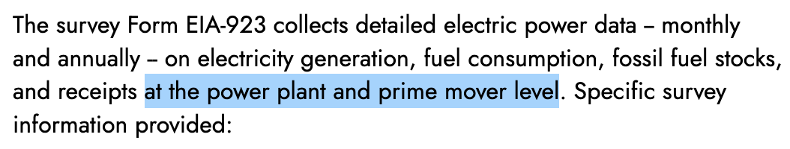
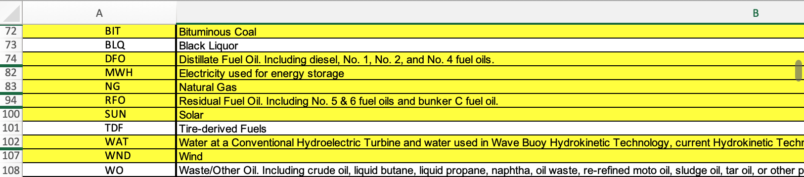

:::::::::::::::::::::::::::::::::::::: questions

- How do I get ready to do research with data that is new to me?
- What should I do when I find something that doesn't look right?
- How can I get a head start on identifying data problems that might cause headaches later?

::::::::::::::::::::::::::::::::::::::::::::::::

::::::::::::::::::::::::::::::::::::: objectives

- Examine data for anomalies using summarization and visualization
- Articulate the difference between refining plots for exploration and refining plots for presentation
- Execute strategies for locating the cause and extent of anomalies

::::::::::::::::::::::::::::::::::::::::::::::::

Now that you have some raw data, how do you get from there to actually doing research with it?

Maybe you already have a research question;
how do you get your data into a form that can help you answer it?
How do you know your data doesn't have gremlins hiding in it that will mess up your research?

In this session we will do some initial data explorations and develop strategies for identifying and diagnosing sneaky data problems
-- including the use of data visualization as part of your exploration toolkit.
Plots aren't just for papers!

## What kinds of data problems are common in energy data?

Data problems come in many different forms, and how you respond to them will depend on the source of the problem and what kind of impact it will have on the kinds of modeling and analysis you want to do.

* **Problems introduced by the respondent** - typos and other data entry errors - These can be fixed if they're simple, or can be a reason to exclude certain rows if correct values can't be reconstructed.
* **Problems introduced by the data aggregator** - disagreement between documentation you received and the actual forms filled out by respondents; a bad choice of data format that doesn't preserve relationships within the data - These can sometimes be "fixed" by working out logically what the definition of a column should actually be, but sometimes not.
* **"Problems" introduced by external forces** - natural disasters, policy change - You may choose to retain or exclude these depending on your exact area of research.
* **Problems we created for ourselves** - We'll talk about this in a later session.

Data problems can occur in a single column, or in the relationship between columns, or even in the relationship between tables.

## What is a good general strategy for finding problems in unfamiliar data?

Data problems aren't always obvious. To uncover them, we will need to go looking for them.

There is a pattern to this:

* Carve off a chunk of data small enough to reason about
* Identify what we expect to see from that data
* Check whether that is actually true or not (sometimes nontrivial)
* Justify or explain any differences between what we expect and what is actually there

When we first start out, our expectations will be quite general, often based on data type -- whether the data is numeric, categorical, or free text.
As we become more familiar with the data, our expectations will become more sophisticated.
Sometimes the data defies our expectations in ways that reveal new research questions instead of, or even because of, new data problems.
Keep an open mind, and keep your research diary handy!

## Put it into practice

Let's take a look at how these ideas apply to real data.

Fire up Jupyter notebook:

```bash
$ uv run jupyter notebook
```

& open `notebooks/5-visual-data-exploration.ipynb`

We're looking at form EIA-923, which covers electricity generation and fuel consumption by plant and prime mover on a monthly and annual basis.

You have a raw file for EIA-923 data from Puerto Rico, and a processed file which was prepared by your predecessor.
The paths are already in the notebook for you:

```python
raw_file = "../data/raw_eia923__puerto_rico_generation_fuel.parquet"
monthly_file = "../data/pr_gen_fuel_monthly.parquet"
```

(Your predecessor also left you their source code,
but we'll start with the data and take a look at the code in another session.
Reading the code will be easier if we are more familiar with the data.)

We will ask ourselves:

* What kinds of data are there? Can I look at just one kind at a time?
* What do I expect to see from this data?
* What do I actually see?
* Can I justify or explain any differences between what I expect and what I actually see?

### Primary keys & index columns

Let's load the processed file and see what's in there.

```python
pr_gen_fuel_monthly = pd.read_parquet(monthly_file)
pr_gen_fuel_monthly
```

EIA-923 records fuel consumption and electricity generation over time.
To better reason about this data frame, it is important to identify its **primary key**:
What columns, taken together, uniquely identify each row of data?
What does each row represent?

If we were familiar with EIA 923 from other research, we might know that already.
If not, we can check the dataset documentation.

The EIA website is a good place to check first for all EIA forms.
[The page for Form EIA-923](https://www.eia.gov/electricity/data/eia923/) has a summary that hints at the primary key:

{alt="Screenshot from the page for Form EIA-923. The text 'at the power plant and prime mover level' is highlighted. The full text reads, 'The survey Form EIA-923 collects detailed electric power data — monthly and annually — on electricity generation, fuel consumption, fossil fuel stocks, and receipts at the power plant and prime mover level. Specific survey information provided...'"}

The documentation suggests a primary key that includes:
the date ("monthly and annually" implies a time series), power plant identifiers, and prime mover.
Sometimes documentation is incomplete, so it's always good to double check.

We can use our problem-hunting strategy to do so.
First, we'll grab just the columns we think define the primary key.

```python
# carve off a chunk: what is the primary key?
# collect plant ids, prime mover, and date
primary_key_columns = ["plant_id_eia", "plant_name_eia", "prime_mover_code", "date"]
pr_gen_fuel_monthly[primary_key_columns]
```

Next, identify what we expect.
For a primary key to do its job, it needs to be unique from row to row.
We expect each set of plant id, name, prime mover, and date values in the data frame to only appear once.

There are lots of ways we could check whether this is really true or not.
`.value_counts()` is a great function for this situation -- it works on single columns, but also on multiple columns taken together.

```python
# what do we expect: each set of values only occurs once
# check whether that's actually true: use value_counts
pr_gen_fuel_monthly[primary_key_columns].value_counts()
```

This tells us that the combination ID 61147, name Costa Sur Plant, prime mover ST, and date 2017-11-01 occurs twice in the data frame.
Not ideal.
Let's see if we can justify that.
Is this a case of a few isolated problems, or a systemic problem, or is our guess at the primary key just wrong?

The output also tells us there are 4504 unique values for our candidate primary key.
We can see there are at least 5 keys that occur more than once.
How common is the duplication?
If there are really only 5 duplicates, it could be a few isolated problems.
If it's significantly more than that, we would start looking at our primary key with suspicion.

Let's filter for just the keys that occur more than once, and see how many there are.

```python
# explain the differences: how many duplicates are there?
pk_sizes = pr_gen_fuel_monthly[primary_key_columns].value_counts()
pk_sizes.loc[pk_sizes>1]
```

554 duplicates out of that 4504... so more than 10 percent.
That's either a massively systemic problem, or there's one or more columns we need to add to our primary key to distinguish between duplicate rows.

::: challenge

Look at one of the duplicate entries and propose another column to add to our primary key.

:::: hint

Use `.loc` to grab the data for one of the duplicate keys.
Are there any columns, other than the measurement columns, that differ between the two entries?

```python
pr_gen_fuel_monthly.loc[
    (pr_gen_fuel_monthly.plant_id_eia == 61147) &
    (pr_gen_fuel_monthly.plant_name_eia == "Costa Sur Plant") &
    (pr_gen_fuel_monthly.prime_mover_code == "ST") &
    (pr_gen_fuel_monthly.date == "2017-11-01")
]
```

::::

:::: solution

If we add `energy_source_code` to our primary key, there are no more duplicates: we uniquely identify all rows.

```python
primary_key_columns = ["plant_id_eia", "plant_name_eia", "prime_mover_code", "energy_source_code", "date"]
pk_sizes = pr_gen_fuel_monthly[primary_key_columns].value_counts()
pk_sizes.loc[pk_sizes>1]
```

::::
:::

We have our primary key!
How does this help us?

* Before, we didn't really know what each measurement corresponded to.
  Fuel consumed, sure, but consumed by what?
  an entire power plant? a single generator? what would that even mean?
  Now we know exactly how everything is aggregated.
* Because each key only appears once, we know that each (plant, prime mover, energy source)
  (the primary key, minus `date`)
  yields a single time series --
  a log of fuel consumption and electricity generation, with only one point for each month.

Since this was annoying to figure out, we should make a note of it in our research diary.
If we have to put this down for a while, future-us will appreciate being able to get a jumpstart when we pick it back up.
For this workshop, I'm making a new document, but I usually keep one running doc for each research project.

```text
# EIA-923 Puerto Rico data

Primary key: ["plant_id_eia", "plant_name_eia", "prime_mover_code", "energy_source_code", "date"]

- you need both prime mover and energy source, because some plants do multiples in both
```

### Zoom in on `energy_source_code`

Let's take a brief detour to talk about data types.

```python
pr_gen_fuel_monthly.dtypes
```

```output
plant_id_eia                                    Int64
plant_name_eia                         string[python]
prime_mover_code                             category
energy_source_code                           category
fuel_consumed_for_electricity_mmbtu           float64
fuel_consumed_mmbtu                           float64
net_generation_mwh                            float64
date                                   datetime64[ns]
dtype: object
```

Primary key columns are often:

* Integers (whole numbers) - used for numeric IDs
* Strings (text) - used for names
* Categories - used for classification among a restricted set of available values
* Dates or times - used for time series records and logs

Categorical data is of special interest when it comes to data problems,
because we need that data to be absolutely pristine to be able to use it in our analyses --
records that use synonyms, creative abbreviations, or have spelling errors won't match with their category-mates.
Thankfully, mistakes are easy to identify.
If the value of a categorical column is not a member of the restricted set, it is invalid,
and likely resulted from a typo or similar error.

Let's take a closer look at `energy_source_code` as an example of categorical data.

We can use `.value_counts()` to quickly see what values appear in the column.

```python
# carve off a chunk: just energy_source_code
# what we expect: a restricted set of values, no typos
pr_gen_fuel_monthly.energy_source_code.value_counts()
```

```output
energy_source_code
DFO    2104
SUN    1148
RFO     548
NG      538
MWH     268
WND     184
WAT     170
BIT      98
Name: count, dtype: int64
```

Does this match our expectation?
It's certainly a restricted set of values.
But how will we know if there are no typos?
Are DFO and RFO different energy sources, or did someone's finger slip...548 times?

This is an example of an underspecified expectation.
To refine it, we need more domain knowledge:
if we knew what values were permissable for this column,
we would be able to evaluate whether RFO is a typo or not.
We can look up what values the EIA says are okay for this column.
Code definitions are almost always in the documentation somewhere.
Digging through the docs
(the grandfather of this data frame is an EIA Excel file; it's in the course repo under `data/eia923_pr.xlsx`)
we find a table of energy source codes and their descriptions:

{alt="Excel screenshot showing tab Page 7 File Layout of data/eia923_pr.xlsx.
Energy source code definitions for the codes we found in our data frame are:
BIT: Bituminous Coal;
DFO: Distillate fuel oil including diesel;
MWH: Electricity used for energy storage;
NG: Natural gas;
RFO: Residual fuel oil;
SUN: Solar;
WAT: Water at a conventional hydroelectric turbine and [other applications];
WND: Wind.
A few additional energy source codes are also visible, including BLQ, TDF, and WO."}

Okay! We found all the codes in the documentation, so there are no typos.

```python
# what we found: no typos
```

But there's something else we can check with the `.value_counts()` output,
and that's how often each code appears in the data frame.
What do you notice about that information?
Does the frequency of each energy source defy any of your expectations?

::: challenge

Write down three notable facts about the distribution of energy source codes in the data frame,
whether each seems normal or odd, and why.

:::: hint

* What energy sources appear most frequently? Is that common for energy generation in the U.S.?
* What energy sources appear least frequently? Is that expected?
* What are the most and least common energy sources in the U.S.? Do those generalizations seem to hold in PR?

::::

:::: solution

Here are a few:

* Lots of oil. That's weird; oil is expensive.
* Solar is surprisingly common. That's weird; solar is growing but like. Not **that** much.
* Wind and hydro are more rare, which seems normal.
* Very few coal entries. Is that expected? Not sure.

Remember though, that these numbers are counting rows of the data frame, not the fuel mix of the grid.
What does each count represent?
From our primary key exploration, we know that each row represents just part of a plant for a particular month.
Each entry counts the same whether it represents a tiny or huge amount of actual generated energy.
What could it mean for an energy source code to have high frequency?

* Many tiny plants
* A smaller number of plants that have operated for a very long time (many months)

We're starting to generate more questions than we can reasonably answer all at once,
so it's a good time to put some notes in our research diary.

```text
Energy source frequency table:
energy_source_code
DFO    2104
SUN    1148
RFO     548
NG      538
MWH     268
WND     184
WAT     170
BIT      98
Name: count, dtype: int64

- Why so much oil and solar?
- Why so little coal?
- Does the fuel mix of the grid match?
- Are the oil and solar plants tiny but many?
- Are the coal plants huge but few?
```

If we want to explore our expectations about the fuel mix of the grid, we'll need to look at the numeric data.

::::
:::

### Summarizing numeric data

As a first step, let's look again at the data types in our data frame:

```python
pr_gen_fuel_monthly.dtypes
```

```output
plant_id_eia                                    Int64
plant_name_eia                         string[python]
prime_mover_code                             category
energy_source_code                           category
fuel_consumed_for_electricity_mmbtu           float64
fuel_consumed_mmbtu                           float64
net_generation_mwh                            float64
date                                   datetime64[ns]
dtype: object
```

The numeric data we want to look at next are in the columns with `float64` data type.
"Float" is short for "floating point", and basically just means a decimal fraction --
it's how we encode continuous measurements on a computer.

Pandas has some built-in tools for summarizing numeric data like this.

```python
# carve off a chunk: fuel consumption continuous measurement columns only
# what we expect: basic good behavior
pr_gen_fuel_monthly[[
    "fuel_consumed_for_electricity_mmbtu",
    "fuel_consumed_mmbtu",
]].describe()
```

```output
fuel_consumed_for_electricity_mmbtu	fuel_consumed_mmbtu
count	4.948000e+03	4.948000e+03
mean	2.880679e+05	2.912271e+05
std	7.149827e+05	7.187600e+05
min	0.000000e+00	0.000000e+00
25%	0.000000e+00	0.000000e+00
50%	2.904000e+03	2.985500e+03
75%	5.604050e+04	5.612400e+04
max	4.701353e+06	4.701353e+06
```

For each column, we get a stack of summary statistics.
We might have expectations for those statistics, or not.

* count: the number of non-null values in the column.
  If this is less than the length of the data frame, we know there are nulls in the column.
* mean, std: the average and standard deviation,
  establishing the center and spread of the distribution of values in the column.
* min, 25-75%, max: the quartiles for the distribution.
  Min and Max can tell you about outliers,
  and the difference between the 50th percentile and the Mean can tell you about skew.

For count, let's check the length of the data frame.

```python
len(pr_gen_fuel_monthly)
```

```output
5058
```

Okay, so we've got ~100 nulls in these columns.
It could be a coincidence that they all have the same number of nulls,
but it seems more likely that the nulls occur in the same places in both columns.
We can make a note of that, in case we need to confirm it later.

```text
- fuel_consumed cols both have like 100 nulls; will this matter?
```

The means look basically plausible, in that they're positive and large enough to believably support a few million people (if less than in the rest of the U.S.).

The standard deviations seem a bit big, since they're larger than the means.

This gets confirmed in the quartiles.
These columns are more than 1/4 zeros,
which means the outliers at the other extreme have to be really huge in order to push the mean up as high as it is.
So we know fuel consumption is dominated by a few really heavy producers.

```python
# what we found: some nulls; large standard deviations; quartiles show a ton of skew
# explain why: mostly small producers with some huge ones dominating overall fuel consumption
# bonus expectation update: patterns we found in record counts unlikely to be reproduced in the actual fuel mix
```

::: challenge

Run `.describe()` on the `net_generation` column.
What do you expect?
What do you find?
How do you explain any differences?

:::: solution

```python
pr_gen_fuel_monthly[[
    "net_generation_mwh",
]].describe()
```

```output
net_generation_mwh
count	4948.000000
mean	27637.307140
std	63891.379411
min	-535.000000
25%	0.478000
50%	538.045500
75%	9808.756000
max	413447.810000
```

There's a similar story for net generation,
with the added bonus that the outliers on the bottom end are negative.
Negative numbers are allowed for net generation, but they should be fairly rare,
so it's good to see that the 25th percentile is above zero, if only barely.
Again, the outliers at the other extreme are simply enormous relative to the majority of records in this data frame,
so we know net generation is also dominated by a few really heavy producers.

::::

:::

We had something in our research diary about this -- let's update it.

```text
- Does the fuel mix of the grid match?
  - probably not: fuel consumed distribution is mostly small values with a small number of huge ones
```

### Visualizing numeric data

To learn more about the actual fuel mix and generation in PR,
we can bring in the the `date` column and start looking at these measurements as time series.
Time series data lends itself to plotting especially well!

Most people are familiar with putting plots in reports, research papers, and presentation slides, where they're useful as evidence supporting your argument.
To be effective, those plots need to -- essentially -- look nice:
clear labels and titles,
appropriate units and limits,
good color separation for print or screen,
tidy legends,
minimizing extraneous data.
The goal is to communicate your point.

When you're in the exploratory phase, you don't know what the point is yet, and you're communicating with yourself, now and future-you.
To be effective, exploratory plots need to tell you something you don't already know,
and ideally they should do that quickly, so you don't lose track of what you're doing.
We can skip a lot of the presentation refinements, so long as a plot is not _actively confusing_.

Pandas has great support for exploratory plotting, since it doesn't require much extra setup,
and the options for presentation refinements are extremely limited,
reducing the risk of going down pixel-perfection rabbit holes.

We already have a solid strategy for identifying data problems:

* Carve off a chunk of data small enough to reason about
* Identify what we expect to see in the data
* Check whether that is actually true
* Justify or explain any differences

Exploratory visualization helps us check whether our expectations are actually true,
but sometimes it can take a few steps to get from the data we have to something we can plot.
We then have to decide whether our plot is showing us enough information to actually check the data,
or if the plot needs a refinement or two to show us everything we need.

Let's look at an example.

#### Plot all monthly variables

Let's look at all the monthly variables at once, for a big-picture look at the energy generated in Puerto Rico as a whole.

```python
# carve off a chunk: monthly fuel consumed and net generation for all of Puerto Rico
# (sum over all plants)
# what we expect:
# some kind of annual cycle
# maybe increasing slowly?
```

How do we check this?
If we were limited to tables and formulas, it would be a huge pain,
but with visualization, we'll be able to get there significantly quicker.
What needs to be in our plot?

* a different line for each variable
* one value for each month -- we'll sum across all the plants

Now let's get pandas to show it to us.

We want one value for each month, so we'll group by date and then sum.

```
pr_gen_fuel_monthly.groupby("date").sum()
```

```output
---------------------------------------------------------------------------
TypeError                                 Traceback (most recent call last)
Cell In[35], line 1
----> 1 pr_gen_fuel_monthly.groupby("date").sum()
[...]
2723     # raise TypeError instead of NotImplementedError to ensure we
2724     #  don't go down a group-by-group path, since in the empty-groups
2725     #  case that would fail to raise
2726     raise TypeError(f"Cannot perform {how} with non-ordered Categorical")

TypeError: category type does not support sum operations
```

Oh no! We can't sum a category column.

```python
pr_gen_fuel_monthly.dtypes
```

```output
plant_id_eia                                    Int64
plant_name_eia                         string[python]
prime_mover_code                             category
energy_source_code                           category
fuel_consumed_for_electricity_mmbtu           float64
fuel_consumed_mmbtu                           float64
net_generation_mwh                            float64
date                                   datetime64[ns]
dtype: object
```

`.sum()` told it to sum all the columns, but we only want to sum the measurement columns,
and leave the primary key columns alone.
We can tell pandas to separate the measurement columns from the primary key by setting an index:

```python
pr_gen_fuel_monthly.set_index(primary_key_columns).groupby("date").sum()
```

An index is a little more general than a primary key, because it doesn't have to be unique.
An index is useful any time you want to hold some columns aside from the measurement columns you want to do math with,
or any time you want to designate certain columns for quickly selecting blocks of rows in your data frame.

But our sum is looking much better. Now plot!

```python
pr_gen_fuel_monthly.set_index(monthly_index_columns).groupby("date").sum().plot()
```

Check: does this plot show us everything we need from it?
Can we see a different line for each variable, and one value per month? Yes.

Does it help us see whether what we expected to find is actually true?

Are there any surprises?
Does the plot make anything visible that we didn't even think to list as an expectation?

```python
# what we found:
# annual cycle: yes
# slowly increasing: no, mostly the same
# surprises: big zero spike in late 2017
# can we explain it? hurricane Maria
```

#### Compare energy source breakdown over time

Let's dive in further and look at the actual fuel mix of the grid.
What does the energy source breakdown look like over time?

Restart the cycle again.

```python
# carve off a chunk: fuel consumed, by energy source, for all of PR
# what we expect:
# does it match plant mix? high oil, high-ish solar, low coal
```

How do we check this?
What needs to be in our plot?

* just fuel consumed mmbtus
* a different line for each energy source: DFO, SUN, NG, etc
* one value for each month -- we'll sum across all the plants

Now let's get pandas to show it to us.
To get `.plot()` to show the lines we want, we'll need to make one column for each energy source,
where each row is the sum for one month.

```python
(
    pr_gen_fuel_monthly
    .groupby(["energy_source_code", "date"], observed=True)
    .fuel_consumed_mmbtu.sum()
    .unstack("energy_source_code").plot()
)
```

Check: does this plot show us everything we need from it?
Do we have a line for each energy source, and one value per month?
Yes, though it's pretty busy.
<!--We may need to split it up to see some elements more clearly.-->

::: challenge

Use this plot to determine whether what we expected to find is actually true.
how does the fuel mix of the grid compare with the frequency of different energy source codes we found in the data frame?

Are there any surprises?

:::: hint

Recall that we found the distribution of energy source codes in the data frame using `.value_counts()`:

```python
pr_gen_fuel_monthly.energy_source_code.value_counts()
```

Recall that overall fuel consumed and net generation took a big hit in late 2017 due to hurricane Maria.
Would we expect all plants to take the same amount of time to come back online after an event like that,
or are some energy sources more difficult to bring back up than others?

A sudden drop that never comes back up is often a sign of a potential data problem.
Do all the drops that appear in this plot recover,
or do some of them continue for long periods of time?
::::

:::: solution

```python
# what we found:
# oil high? yes
# solar high-ish? no, very low
# coal low? no, medium
# surprises:
# NG about as high as oil! & seem to trade off on >1yr timescales, maybe based on price?
# Maria affects all energy sources, but coal and renewables take a long time to recover
# Speaking of: what does "fuel consumed" even mean for renewables?
# And why do all renewables drop suddenly in 2022 and never come back?
```

Some of these point not to data problems, but to possible research questions.
Let's drop those in our research diary as well:

```text
Potential research projects
- Do oil and ng trade off dominance due to price or some other factor?
- Hurricane recovery differs by energy source

Weird stuff
- Why do renewables even have fuel consumed
- Renewables fuel consumed drops in 2022 and never recovers to previous levels; real or no?
```

::::

:::

Renewables is a puzzle, and that drop in 2022 looks pretty serious.
Depending on the cause, it could definitely affect any research we'd do with this data.
We should investigate further.

#### Focus on renewables

This is an appropriate time for refinement: the current graph settings aren't giving us enough detail on the renewable energy sources.

Let's put the renewables on their own plot so we can see them better.

```python
renewables = ["SUN", "WND", "WAT"]
(
    pr_gen_fuel_monthly
    .loc[pr_gen_fuel_monthly.energy_source_code.isin(renewables)]
    .groupby(["energy_source_code", "date"], observed=True)
    .fuel_consumed_mmbtu.sum()
    .unstack("energy_source_code").plot()
)
```

Okay, yes, that is dramatic.
We can also see that hydro spends a lot of time offline.
Sufficiently so that we can't really see if it's affected by whatever has happened in 2022.

Does this 2022 event show up in the net generation as well?

<!-- consider refreshing the cycle here; we have a new hypothesis. -->

:::: challenge

Adapt our current fuel_consumed_mmbtu plot to show net_generation instead.

:::::::: solution

```python
# carve off a chunk: net generation, by energy source, renewables only
# what we expect: maybe also drops in 2022?
(
    pr_gen_fuel_monthly
    .loc[pr_gen_fuel_monthly.energy_source_code.isin(renewables)]
    .groupby(["energy_source_code", "date"], observed=True)
    .net_generation_mwh.sum()
    .unstack("energy_source_code").plot()
)
```

No, not really :(

```python
# what we found: no
# explain why: ???
```

::::::::

:::

#### Try a scatter plot

Okay, what else could it be?
Maybe a big renewables plant opened or closed that did things differently than the others?
Let's look for patterns or clusters in the relationship between net generation and fuel consumed mmbtus for renewables.

```python
# carve off a chunk: netgen and fuel consumed for renewables
# what we expect: ? some factor that explains fuel drop in 2022
```

What could help us check this?
Scatter plots are great for any time you suspect you have multiple distinct behaviors in your data.
If we make a scatter plot of net generation against fuel consumed,
and we get clear separation between groups of points,
then identifying what each group has in common could help explain this fuel drop.

What needs to be in our plot?

* one point for each row, renewables only
* net generation on the x axis
* fuel consumed on the y axis

Now let's get pandas to show it to us.

```python
renewables_monthly = pr_gen_fuel_monthly.loc[pr_gen_fuel_monthly.energy_source_code.isin(renewables)]
(
    renewables_monthly.plot
    .scatter(x="net_generation_mwh", y="fuel_consumed_mmbtu")
)
```

Check: does this show us a scatter plot with netgen on the x and fuel consumed on the y?
Yes, and we can even see there are at least two distinct patterns.
It's pretty blobular though, and that makes it tough to see whether there are only two or if more are hiding here in this top one.

This is an appropriate time for refinement: the current graph settings aren't giving us all the information we want.

We can reduce the size of each point to see if that gives us clearer separation.

```python
(
    renewables_monthly.plot
    .scatter(x="net_generation_mwh", y="fuel_consumed_mmbtu", s=0.5)
)
```

Is that three lines?
Three lines for three energy sources?
Awfully suspicious.

This is another appropriate time for refinement: we can add color to show whether each line is for a different energy source.

```python
(
    renewables_monthly.plot
    .scatter(x="net_generation_mwh", y="fuel_consumed_mmbtu", s=0.1, c="energy_source_code")
)
```

oh gee thanks pandas, the default colormap is grayscale.
That's not helping at all.

```python
(
    renewables_monthly.plot
    .scatter(x="net_generation_mwh", y="fuel_consumed_mmbtu", s=0.1, c="energy_source_code", colormap="rainbow")
)
```

Oh do not like that.
Instead of each line a different color, there are colors for all three energy sources on all the lines.
So energy source code does not help us separate the groups we see in this plot.

:::: challenge

Are there any other variables in our data that, when used to color this plot, clearly separate the lines by color?

::::::: solution

Disappointingly, `date` is the only one that really does it:

```python
(
    renewables_monthly
    .plot.scatter(x="net_generation_mwh", y="fuel_consumed_mmbtu", s=0.2, c="date", colormap="rainbow")
)
```

But at least it clearly identifies three lines.
We wanted to know what each group had in common, so that it would help us explain the drop in 2022.
Since the only thing the groups really have in common is date,
this feels like a policy change effect --
a coordinated change throughout Puerto Rico in how fuel consumption is reported for renewables.

```python
# what we found: only date really helps
# explain why: policy change maybe?
```

:::::::

::::

#### Try plotting the heat rate

We've probably extracted all the information we can out of this scatter plot.
Sometimes viewing the same data from another angle can reveal further insights.
Let's try that now: What are the slopes of these lines?

```python
# carve off a chunk: still netgen and fuel consumed for renewables
# what we expect: ? some factor that supports or eliminates the policy change explanation
# how to check: plot slopes of the scatter plot lines, by date
```

Fuel consumed per MWH generated is the heat rate, and we can compute that directly:

```python
(
    renewables_monthly
    .assign(heat_rate=renewables_monthly.fuel_consumed_mmbtu/renewables_monthly.net_generation_mwh)
    .plot.scatter(x="date", y="heat_rate", s=0.5, c="date", colormap="rainbow")
)
```

Oh hey, more subtle than we thought.
It looks like whatever constant everyone was using to compute fuel consumption changed a little bit each year,
with a big gap for Maria,
and then suddenly decided once and for all in 2022.


:::: callout

This was a real policy change, and it affected more than Puerto Rico!

Starting in 2023 (in which reports on 2022 data were published),
the EIA changed how it assesses noncombustible renewable energy contributions.
The old way used a fossil fuel equivalency approach and was adjusted each year using an average heat rate;
the new way uses a captured energy approach and uses a constant heat conversion factor.

For more information, see this [CleanEnergyTransition explainer](https://www.cleanenergytransition.org/post/understanding-how-the-eia-is-measuring-noncombustible-renewables?u).

::::

The colormap made it easy to see how the different heatrate values corresponded to our line chart from before,
but it's making these little stragglers hard to see.
Now that we have established some continuity from the previous plot,
we can drop the colormap and focus on the stragglers.

```python
(
    renewables_monthly
    .assign(heat_rate=renewables_monthly.fuel_consumed_mmbtu/renewables_monthly.net_generation_mwh)
    .plot.scatter(x="date", y="heat_rate", s=0.5)
)
```

Are those individual plants or some other effect?

```python
(
    renewables_monthly
    .assign(heat_rate=renewables_monthly.fuel_consumed_mmbtu/renewables_monthly.net_generation_mwh)
    .assign(plant_factor=renewables_monthly.plant_name_eia.astype("category"))
    .plot.scatter(x="date", y="heat_rate", s=0.5, c="plant_factor", colormap="rainbow")
)
```

This colormap is a little too squished to tell us exactly which plant is the troublemaker, but it does give us enough to suggest that it's only one or two plants.
If we wanted to figure out exactly which ones, we could split the data by year, use `.describe()` to get the median ratio for each year, then select all the rows that had a different ratio.
We'll leave that for future research!

In the meantime, let's review:
We were able to use timeseries plots to identify a weird effect in the data, and then use two other visualizations to narrow down the cause and extent of the weirdness.
We now know that any models that make use of fuel consumed or heat rate will need to account for the changes in how renewables were handled in pre- and post-2022 data.
Any models that compare or rely on differences in heat rates between plants will probably need to exclude renewables entirely.

One last update for the diary:

```text
Renewables drop suddenly in 2022 and stay low -- probably a policy change:
- Renewables all show same heat rate, updated each year, then constant starting 2022
- where does this heat rate come from?
- there are a bunch of stragglers that don't use the common heat rate. maybe exclude those plants or points?
- :x: definitely exclude renewables from heat rate analyses involving combustibles
```

::::::::::::::::::::::::::::::::::::: keypoints

- Different kinds of data -- indexing, categorical, numeric, time series -- are suited to different kinds of summarization and visualization.
- Successful strategies for assessing data problems alternate between noticing your expectations about the data and checking to see if the data match your expectations -- and sometimes, updating your expectations based on what you find!
- Visualization is not just for reports, papers, and talks! If you incorporate plotting into your exploration & troubleshooting toolbox, you'll be able to identify and diagnose data problems much more quickly than if you wait for your model to exhibit strange behavior.

::::::::::::::::::::::::::::::::::::::::::::::::
