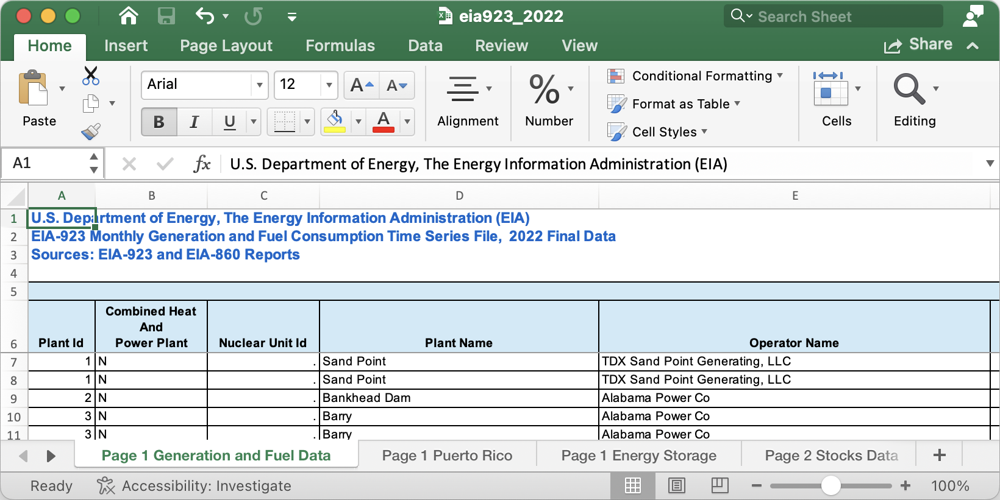
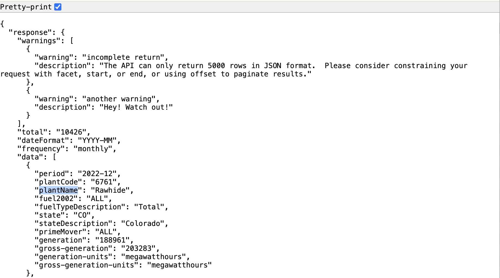
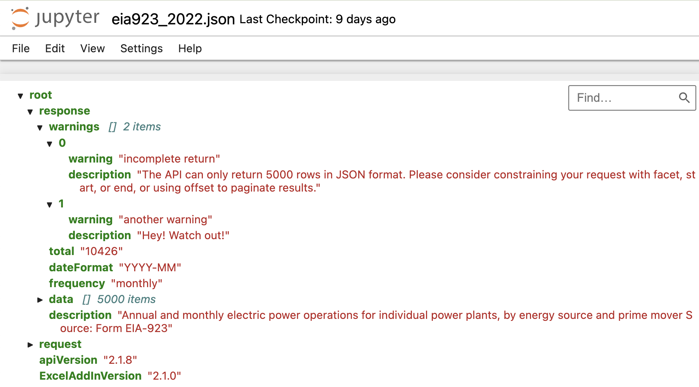
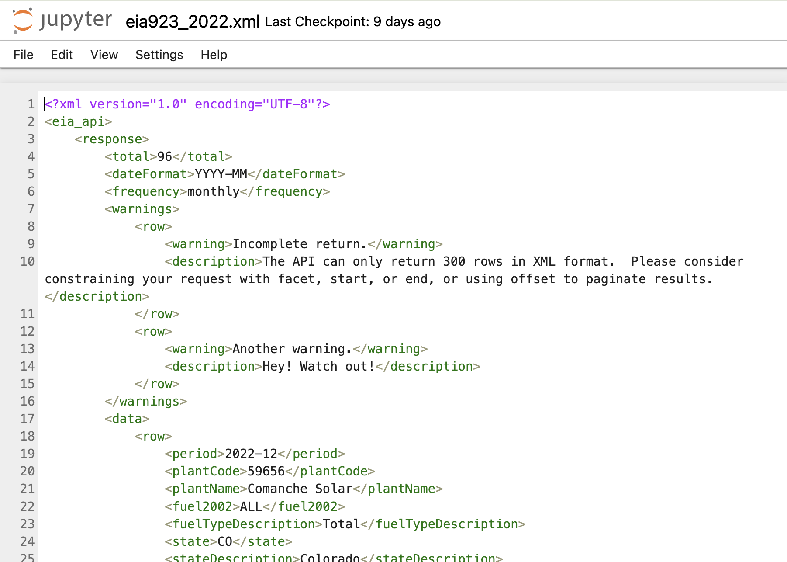

:::: instructor
In preparation for this lesson:

* In Jupyter Notebooks, open the instructor copy of the 2-diverse-filetypes.ipynb notebook
* In another tab, open the json file with pretty-print turned on
* In another Jupyter Notebooks tab, open the directory view to make it possible to visualize the json and xml files
* Open the `data/eia923_2022.xlsx` file using your computer's spreadsheet software (e.g., Excel)

::::

:::: questions

- How can I read in different tabular file formats to a familiar data type in Python?
- What are some common errors that occur when importing data, and how can I troubleshoot them?
- What are some common ways metadata gets mixed in with tabular data, and how can I pull out just the table?

::::

:::: objectives

- Import tabular data from Excel, JSON, and XML formats to pandas dataframes using the `pandas` library.
- Preview data files in Excel, JSON, and XML to identify how metadata has been placed alongside tabular information.
- Use `help` and function documentation to select and set parameters in function calls.

::::

## Untangling a data pile
While poking around in your lab's computer, you find the folder that the postdoc was
using to store data inputs to his model. Inside the `data` folder, however, is a bit of
a mess! Every file in the folder has the same name ("eia923_2022") but a different file
extension. To make sense of this undocumented pile of files, we'll need to read in each
file and compare them.

## EIA 923 data
The Energy Information Administration (EIA)'s [Form 923](https://www.eia.gov/electricity/data/eia923) is known as the Power Plant Operations Report. The data include electric power generation, energy source consumption, end of reporting period fossil fuel stocks, as well as the quality and cost of fossil fuel receipts at the power plant and prime mover level (with a subset of +10MW steam-electric plants reporting at the boiler and generator level). Information is available for non-utility plants starting in 1970 and utility plants beginning in 1999. The Form EIA-923 has evolved over the years, beginning as an environmental add-on in 2007 and ultimately eclipsing the information previously recorded in EIA-906, EIA-920, FERC 423, and EIA-423 by 2008.

Given your interest in generation and fuel consumption data for your research, the EIA
Form 923 data is a great starting point for data exploration.

## Get ready

Open up the notebook for this lesson by running

```bash
$ uv run jupyter notebook
```

from the `open-energy-data-for-all` directory. Then in the Jupyter browser, open `notebooks/2-diverse-filetypes.ipynb`.

## Reading tabular data with Pandas

One of the most popular libraries used to work with tabular data in Python is called the
[Python Data Analysis Library](https://pandas.pydata.org/) (or simply, Pandas). Pandas
has functions to handle reading in a diversity of file types, from CSVs and Excel spreadsheets to more complex data formats such as XML and Parquet. Each read function offers a variety of parameters designed to handle common complexities specific to the file type on import. For a refresher on Pandas, Pandas DataFrames and reading in files, see the [Starting with Data](https://datacarpentry.github.io/python-ecology-lesson/instructor/02-starting-with-data.html) lesson.

:::instructor
We recommend skipping the below call-out unless people run into filepath issues.
:::

::: callout
### Identifying file paths

In order to read data into Pandas or any Python function, we'll need to identify the
*path* to that file. The path tells the code where that file lives. There are two ways
to specify the path to any file on your computer:

- __Absolute path__: An absolute path specifies a location from the root of the filesystem.
- __Relative path__: A relative path specifies a location starting from the current location. The relative path is just a subset of the absolute path.

For example, to get to the `eia923_2022.json` file in the `data` folder from a notebook
in the `open-energy-data-for-all` folder, we can either specify:

- __Absolute path__: `/home/user/Desktop/path/to/open-energy-data-for-all/folder/data/eia923_2022.json`
- __Relative path__: `data/eia923_2022.json`
:::

### Excel format

Of all the files in the `data` folder, the Excel file is most familiar, so you decide to start with that.

It is always a good idea to preview a file before starting to write code for it, so that you know what to expect if your code is working correctly. For an Excel spreadsheet, appropriate preview applications include Microsoft Excel (naturally), Apple Numbers, or LibreOffice.

When opening the file in a spreadsheet application, you see that the first few rows look like this:

::: instructor
Go ahead and open the `eia923_2022.xlsx` file in your local spreadsheet software (e.g., Excel, OpenOffice).
:::

{alt="Snapshot of
the Excel file showing the first 6 rows contain metadata, blank spaces and column
names, and there are at least 4 sheets available."}

There are three things to note in the preview:

- This file includes multiple sheets (Page 1 Generation and Fuel Data, Page 1 Puerto Rico, Page 1 Energy Storage, etc.). We'll use the first sheet for this example.
- Once correctly read into pandas, the table from the first sheet will have column names like Plant Id, Nuclear Unit Id, Plant Name, Operator Name, etc.
- The column headers do not start in the first row of the spreadsheet. Instead, there are a few rows of metadata. We'll need to deal with this if we want the table to read in properly.

Now we can head over to a Python notebook.

#### Reading an Excel file with Pandas

To read in an Excel spreadsheet using `pandas`, you will use the `read_excel()` function:

```python
import pandas as pd
pd.read_excel('data/eia923_2022.xlsx')
```

That took a while! Something our preview didn't tell us was the scale of this dataset. Since we're still prototyping, we don't want to wait that long every time we refine our reading-in code, so let's address that now.

Luckily,`read_excel()` offers built-in functionality to handle various Excel formatting
challenges. Let's see if there's a way to quickly explore a smaller subset of the data. While we can always look up documentation online, we can also access a function's documentation right in Python. To identify which parameter might be able to help us, we can use the `help()` function to pull up the function documentation:

```python
help(pd.read_excel)
```

For each parameter, the documentation provides the name of the parameter, the format for the parameter input (e.g., list, string, int), the default value if no value is provided, and an explanation of what the parameter does.

We can see that the `nrows` parameter provides the following documentation:

```output
nrows : int, default None
    Number of rows to parse.
```

So, if we only want to parse the first 100 rows of the data, we can call:

```python
pd.read_excel('data/eia923_2022.xlsx', nrows=100)
```

That's much faster.
But now we can see that that extra metadata in the first few rows is, indeed, messing up how the table is read: the column headers are full of "Unnamed" and the first few rows are full of NaN.
Row 4 has the column headers we expect, so if we can figure out how to start the table on that row instead, we should be in better shape.

:::::::: challenge

### Challenge 1: handling Excel formatting on read-in

Looking at the documentation for `pd.read_excel()`, identify the parameter needed to ignore the first few rows of the spreadsheet. Then, using `pd.read_excel()`, read in the `eia923_2022.xlsx` file using this parameter to skip any rows that don't contain the column headers. Store the result in a variable called `eia923_excel_df`.

:::: solution

```python
import pandas as pd

eia923_excel_df = pd.read_excel('data/eia923_2022.xlsx', skiprows=5)
```

::::

::::::::

Now the columns match what we expect: each row contains monthly generation data for each plant's prime mover.


:::: caution

Data quirk alert!

While a subset of plants fill out Form 923 at the boiler and generator level, a large proportion of plants only report at this more aggregated level. For more on the nuances of the Form 923 data, see PUDL's [data source page for EIA-923](https://catalystcoop-pudl.readthedocs.io/en/latest/data_sources/eia923.html).

::::

### JSON format

JavaScript Object Notation (JSON) is a lightweight file format based on name-value pairs, similar to Python dictionaries. JSON is often used to send data to and from web applications, and is one of the most common formats available when you're accessing data from an Application Programming Interface (API). JSON data can be found saved as either `.json` or `.txt` files.

JSON is an incredibly flexible format, and can be used to store data with arbitrary nested/tree-like structures. Tables in JSON usually take the form of a list of dictionaries or a dictionary of lists.

Pandas has a function called `pd.read_json()` which can handle JSON data, but _only if a table is the only thing in the file_. This is rare -- most often a JSON table has metadata stuck to it, just like we saw in the Excel file.

Let's take a look at the JSON file in our data directory. Since a JSON file is just text, you can preview it with any application that can read text. A web browser will often give you a "pretty print" option that makes the dictionaries easier to keep track of, so let's try that:

{alt="Snapshot of
the JSON file showing the first few keys contain metadata, warings, and generation data."}

There are three things to note in the preview:

- There are multiple levels of nesting in here, so we won't be able to use `pd.read_json()`
- There are multiple tables in here, in list-of-dictionaries form: a warnings table and a data table.
- Once correctly read into pandas, the warnings table will have column names `warning` and `description`. The data table will have column names like `period`, `plantCode`, `plantName`, `fuel2002`, etc.

There's another preview tool that makes it easier to see the nesting structure of JSON files, but harder to see the similarity to Python dictionaries and lists. The Jupyter file browser parses JSON into a tree structure:

{alt="Snapshot of
the JSON file showing a hierarchical descent from root, to response, to warnings, to two list items with numeric keys 0 and 1."}

To find the list-of-dictionaries structure for tables in this view, you'll look for "[] _n_ items" to indicate a list, then under each number, only one level of key-value pairs. For the warnings table, `warnings` is the list header, then under 0 we see `warning` and `description` but the only thing inside each of those is text. That makes this a list of dictionaries, and thus we can treat it like a table.

Now we can head over to a Python notebook.

#### Reading a JSON file with Pandas

We know from the preview that `pd.read_json()` won't help us. But we _also_ know that a `pd.DataFrame` accepts a list of dictionaries in its constructor, and both tables in our file are formatted as lists of dictionaries -- so let's connect the dots.

The `json` library translates between Python and JSON data. `json.load()` takes JSON-formatted data as input and produces the equivalent Python data structure as output: dictionary to dictionary, and list to list.

Unlike pandas, `json.load()` doesn't know what to do with just a filename; we have to open the file for it first. To do so, we use the `open()` function.

:::instructor
We recommend skipping the below call-out unless students ask more about what's actually going on or you're ahead on schedule - it's an aside that we don't necessarily need to get into.
:::

:::callout
When we `open()` a file in Python, we should always close it after we've extracted the data we need. Closing a file frees up system resources and ensures that we aren't accidentally modifying our original file.

To automatically handle file opening and closing, we use a *context manager*. Using the word `with`, we put all the code we want to run on the opened file into an indented block.
:::

```python
import json
with open('data/eia923_2022.json') as file:
    eia923_json = json.load(file)

eia923_json
```

The first part of the result looks like this:

```output
{'response': {'warnings': [{'warning': 'incomplete return',
    'description': 'The API can only return 5000 rows in JSON format.  Please consider constraining your request with facet, start, or end, or using offset to paginate results.'}],
  'total': '10426',
  'dateFormat': 'YYYY-MM',
  'frequency': 'monthly',
  'data': [{'period': '2022-12',
    'plantCode': '6761',
    'plantName': 'Rawhide',
    'fuel2002': 'ALL',
    'fuelTypeDescription': 'Total',
    'state': 'CO',
    'stateDescription': 'Colorado',
    'primeMover': 'ALL',
    'generation': '188961',
    'gross-generation': '203283',
    'generation-units': 'megawatthours',
    'gross-generation-units': 'megawatthours'},
    ...
```

By using `json.load()`, we've read our file into a Python dictionary. now we just have to extract one of the tables to hand off to the DataFrame constructor. We'll do the warnings table together, then you'll do the data table on your own.

```python
eia923_json['response']['warnings']
```

```output
[{'warning': 'incomplete return',
  'description': 'The API can only return 5000 rows in JSON format.  Please consider constraining your request with facet, start, or end, or using offset to paginate results.'},
 {'warning': 'another warning', 'description': 'Hey! Watch out!'}]
```

That's the list of dictionaries we expect from tabular data, so the DataFrame constructor should be able to handle the rest:

```python
pd.DataFrame(eia923_json['response','warnings'])
```

```output
|           warning |                                       description |
|------------------:|--------------------------------------------------:|
| incomplete return | The API can only return 5000 rows in JSON form... |
|   another warning |                                   Hey! Watch out! |
```


:::: caution

API quirk alert!

The first row of this table is letting us know that when the postdoc queried and saved this data from the API, he only got the first 5,000 rows of data. Many APIs limit the amount of data you can retrieve at once like this, and to get the entire dataset you would need to submit multiple requests in an operation called _paging_. We'll tackle this problem in a later episode, but for now let's investigate the data that we do have saved locally.

::::

:::::::: challenge

### Challenge 2: find that table!

Fill in the blanks in the code below to read in the `data` from the `eia923_2022.json` file into a Pandas DataFrame.

```python
with open('data/eia923_2022.json') as file:
    eia923_json = ...

eia923_json_df = pd.DataFrame(eia923_json[...])

```

Bonus question if you finish early -- how does this table differ structurally from the one we read from the Excel file? Which one would you choose if you wanted to compare monthly generation statistics from two plants over the last 10 years?

:::: hint
First, read in the file using `open()` and `json.load()`. Once you've read in the file,
you can iterate through the `.keys()` of the dictionary to find the path to the `data` portion of the
file.
::::

:::: solution

```python
import pandas as pd
import json

import json
with open('data/eia923_2022.json') as file:
    eia923_json = json.load(file)

eia923_json_df = pd.DataFrame(eia923_json['response']['data'])
eia923_json_df
```

In `eia923_excel_df`, each row represents a year of data, with a separate column for each month. In `eia_json_df`, each row represents a month of data. A 10-year timeseries of two plants would be easier to produce from the json df, but if you wanted to compare seasonal trends between years, the excel df might be easier.

::::

::::::::

## Deciphering XML

eXtensible Markup Language (XML) is a plain text file that uses tags to describe the
structure and content of the data they contain.
Like in other markup languages (e.g., HTML), XML tags wrap around data, providing information about the structure, format, and relationships between components.
For instance, the `<row>` tag will contain a row of data, while `<plantCode>243</plantCode>`  means that the plant code is 243.

Jupyter is a good way to preview XML data, so let's pull up our EIA 9223 file:

{alt="Snapshot of
the XML file showing nested tags from eia-api, to response, to warnings, etc."}

We can see some similar structures here as we found in the JSON file. Notably:

- There are multiple tables in here: a warnings table and a data table.
- Once correctly read into pandas, the warnings table will have column names `warning` and `description`. The data table will have column names like `period`, `plantCode`, `plantName`, `fuel2002`, etc.

A tag in XML format shares similarities with a key in JSON format:

- both provide a label for what the value _is_ (e.g., a warning, a plant name)
- both provide information about nested relationships (e.g., the response contains a warnings table and a data table; each row in the warnings table contains a warning and a description)

However, unlike JSON, XML tags:

- can have additional attributes (e.g., `<data type="float" precision=3 variable_name="net-generation-mw">3.142</data>`),
providing a way to share more complex metadata about a given data point and to search for tags matching
additional filters (e.g., all data with a particular variable name).

While XML is harder and slower to read than JSON, it also has more capabilities. You might
be likely to see an XML file if the data you're looking at:

- is old! XML was invented in 1998 and is still widely in use in older data distribution
methods.
- has deeply nested hierarchies of relationships, like FERC's accounting data.
- is large and complex! For instance, JSON can only handle strings, numbers and booleans,
while XML can also be used to share images, charts and graphs.
- is distributed through an RSS feed. For instance, FERC publishes filings on a rolling
basis using an RSS feed and the XML data format.

## Using `pd.read_xml()`

Like with our other data types, we can use `pd.read_xml()` to parse XML files into Pandas DataFrames. `pd.read_xml()` is designed to ingest tabular data. In an XML file, this looks like some element which contains a set of rows, each of which contains a set of columns (and nothing else). To use this method, we'll need to
identify where in our XML file the table we want is located. For more on `pd.read_xml()`, see the [Pandas documentation](https://pandas.pydata.org/docs/reference/api/pandas.read_xml.html#pandas.read_xml#notes).

We'll extract the warnings table together, then you'll do the data table on your own. `pd.read_xml()` has some pretty sophisticated arguments available, but we'll try simple first. Let's try reading in the file as-is:
```python
pd.read_xml('data/eia923_2022.xml')
```

Hm, that doesn't look quite right -- those are not the columns we identified when we were looking at the preview. It seems pandas has attempted to interpret the top level of the XML file as if it were a table, with the `<response>`, `<request>`, and sibling tags as rows, and the next level down as columns.

We want just the warnings table. To tell pandas where to find it, we can use the `xpath` parameter to specify the row tags within our XML file that we want to use for our table.

`xpath` queries are quite powerful, but in their simplest form they resemble the same kind of path you would use to specify a directory in a terminal: a sequence of tags, separated by slashes.

So to get all the `<row>`s of the `<warnings>` table, we call:
```python
pd.read_xml('data/eia923_2022.xml', xpath = "response/warnings/row")
```

::: challenge
### Challenge 3: Reading in XML data

Read in all the rows of the `data` table in `eia923_2022.xml` into a Pandas DataFrame, using
`pd.read_xml` and the `xpath` parameter. Store the result in a variable called `eia923_xml_df`.

Bonus question if you finish early -- how does this table differ in content from the one we read from the JSON file?

::: solution
```py
eia923_xml_df = pd.read_xml('data/eia923_2022.xml', xpath = "response/data/row")
```

The XML data covers from January to December of 2022, but has only 96 rows. The JSON data only covers July to December, but has 5000 rows.

:::

:::

::: callout
`xpath` can be used to make more complex queries (e.g., only picking `<row>`s with a certain value for `primeMover`), but we won't cover more advanced usage of `xpath` in this tutorial.
See this [Library Carpentries tutorial](https://carpentries-incubator.github.io/lc-webscraping/02-xpath/index.html) for more about `xpath`.
:::


## `pd.read_parquet()`

There's one more file left in the `data` folder the postdoc left behind - a Parquet file!
You can think of Parquet files as spreadsheet storage optimized for computers. Like an
Excel file, it's very difficult for a human to read the plain text of the file, as
it is designed to be read efficiently by software.

Parquet files:
- are designed to efficiently process and store large volumes of data, making them about
50x faster than using `pd.read_csv()` on comparable file sizes.
- are saved with data organized into chunks (e.g., one chunk per month), making it possible
to quickly load data from some part of the dataset without loading everything into memory.
- are supported by many existing tools, including `Pandas`.

We'll be using Parquet files extensively in the rest of this course, but reading them in does not share the same challenges as the other formats we've talked about today.
We can read a Parquet file to a Pandas DataFrame using `pd.read_parquet()`:

```py
eia923_parquet_df = pd.read_parquet('data/eia923_2022.parquet')
```

:::: callout
To get into the technical weeds of Parquet files, see
the [Parquet documentation](https://parquet.apache.org/docs/overview/). For a desktop viewer
similar to Excel, we recommend checking out [Tad](https://www.tadviewer.com/).
::::

:::: instructor
Below is an optional challenge that is likely to get cut for time. It is intended to
refresh students' data exploration skills, and build intuition around comparing datasets.
Plus, it's a nice ice-breaker. This may be appropriate if you're only teaching the first two episodes, or if you're particularly interested in developing the data exploration and comparison skills of your cohort.
::::

:::::::: challenge
#### Challenge 4: Comparing datasets

Pick two datasets we've just read in, and compare them. How are they similar, and how are they different? Share your reflections with a peer.

:::: hint

- `df.info()` provides a high level summary of the data, including the
columns available, their data types, the number of non-null values in each column, and the overall number of rows in the DataFrame.
- Inspect a column in a DataFrame `df` by using `df[column_name]`.
- To quickly see what values are contained in a column, you can use `df[column_name].unique()` to get a list of unique values in the column.
- Try using `df.iloc[0]` to get the values from the first row of the data.
- `df.head(n)` returns the first n rows of the data, and `df.tail(n)` returns the last n rows.

::::

::::::::

:::: keypoints

- `pandas` has functionality to read in many data formats (e.g., XLS, XML, Parquet) into Pandas DataFrames in Python. We can take advantage of this to
transform many kinds of structured and semi-structured data into similarly formatted data.
- The `help` function can be used to access function documentation, providing avenues to resolve problems on import of various data types.
- Preview tools can help you:
  - Know what to look for in your DataFrame in order to determine if you have read it in correctly
  - Understand what has gone wrong if your DataFrame looks all messed up
  - Formulate arguments which tell pandas what parts of a file to extract as a table and what parts to ignore

::::
