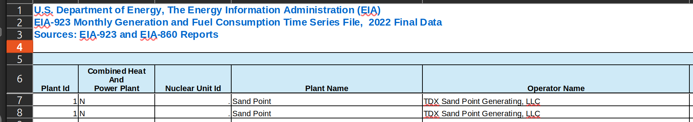

Expected duration: 45 min?

:::: questions

- How can I read in different tabular data types to a familiar format in Python?
- What are some common errors that occur when importing data, and how can I troubleshoot them?

::::

:::: objectives
- Import tabular data from Excel, XML, JSON, and Parquet formats to pandas dataframes using the `pandas` library
- Use `pandas` documentation to select and implement parameters - refine this.

::::


:::: keypoints 

- `pandas` has functionality to read in many data formats (e.g., XML, JSON,
Parquet) into the same kind of DataFrame in Python. We can take advantage of this to
transform many kinds of data with similar functions in Python.
- `pandas` accepts both relative and absolute file paths on read-in.

::::

# Untangling a data pile
While poking around in your lab's computer, you find the folder that the postdoc was
using to store data inputs to his model. Inside the `data` folder, however, is a bit of
a mess! Every file in the folder has the same name ("eia923_2022") but a different file
extension. To make sense of this undocumented pile of files, we'll need to read in each
file and compare them. 

# EIA 923 data
The Energy Information Administration (EIA)'s [Form 923](https://www.eia.gov/electricity/data/eia923) is known as the Power Plant Operations Report. The data include electric power generation, energy source consumption, end of reporting period fossil fuel stocks, as well as the quality and cost of fossil fuel receipts at the power plant and prime mover level (with a subset of +10MW steam-electric plants reporting at the boiler and generator level). Information is available for non-utility plants starting in 1970 and utility plants beginning in 1999. The Form EIA-923 has evolved over the years, beginning as an environmental add-on in 2007 and ultimately eclipsing the information previously recorded in EIA-906, EIA-920, FERC 423, and EIA-423 by 2008.

    TODO: Why is it a good choice for answering the question?

# Reading Excel files with Pandas

One of the most popular libraries used to work with tabular data in Python is called the
[Python Data Analysis Library](https://pandas.pydata.org/) (or simply, Pandas). Pandas
has functions to handle reading in a diversity of file types, from CSVs and Excel spreadsheets to more complex data formats such as XML and Parquet. Each read function offers a variety of parameters designed to handle common complexities specific to the file type on import. For a refresher (TODO: Is this an ok wording?) on Pandas, Pandas DataFrames and reading in files, see the [Starting with Data](https://datacarpentry.github.io/python-ecology-lesson/instructor/02-starting-with-data.html) lesson.

Of all the files in the `data` folder, you decide to start with the Excel spreadsheet.
To read in an Excel spreadsheet using `pandas`, you will use the `read_excel()` function:

```python
import pandas as pd
pd.read_excel('data/eia923_2022.xlsx')
```

Unfortunately, something doesn't look quite right! When opening the file in a
spreadsheet software, you see that the first few rows look like this:

{alt="Snapshot of
the Excel file showing the first 6 rows contain metadata, blank spaces and column
names."}

To read the spreadsheet in correctly, we want to ignore these first five rows. Luckily,
`read_excel()` offers built-in functionality to handle various Excel formatting
challenges. To identify which parameter we need to use to skip these rows when reading
in the file, we can use the `help()` function to pull up the function documentation:

```python
help(pd.read_excel)
```

For each parameter, the documentation provides the name of the parameter, the format for the parameter input (e.g., list, string, int), the default value if no value is provided, and an explanation of what the parameter does.

For example, the `nrows` parameter provides the following documentation:

```output
nrows : int, default None
    Number of rows to parse.
```

So, if we only want to parse the first 100 rows of the data, we can call:

```python
pd.read_excel('data/eia923_2022.xlsx', nrows=100)
```

:::callout
TODO: Absolute and relative file paths should live here? Or elsewhere?
:::

:::::::: challenge

## Challenge 1: handling Excel formatting on read-in

Looking at the documentation for `pd.read_excel()`, identify the parameter needed to skip the first few rows of the spreadsheet. Then, using `pd.read_excel()`, read in the "Page 1 Generation and Fuel Data" sheet using this parameter to skip any rows that don't contain the column headers.

:::: solution

```python
import pandas as pd

excel_923 = pd.read_excel('data/eia923_2022.xlsx', sheet_name="Page 1 Generation and Fuel Data", skiprows=5)

# sheet_name can also take the number of the sheet
excel_923 = pd.read_excel('data/eia923_2022.xlsx', sheet_name=0, skiprows=5)
```

::::

::::::::

Each row contains monthly generation data for each plant's prime mover. While a subset of plants fill out Form 923 at the boiler and generator, a large proportion of plants only report at this more aggregated level. For more on the nuances of the Form 923 data, see PUDL's [data source page](https://catalystcoop-pudl.readthedocs.io/en/latest/data_sources/eia923.html).

# Reading JSON files with Pandas

JavaScript Object Notation (JSON) is a lightweight file format based on name-value pairs, similar to Python dictionaries. JSON often used to send data to and from web applications, and is one of the most common formats provided when you're accessing data from an Application Programming Interface (API). JSON data can be found saved as either `.json` or `.txt` files.

If we look at a single record from `eia923_2022_sample.json`, we can see that each name-value pair corresponds to one row and one column in a tabular dataset.

```output
{"period":"2022-12","plantCode":"6761",
 "plantName":"Rawhide","fuel2002":"ALL","fuelTypeDescription":"Total","state":"CO","stateDescription":"Colorado","primeMover":"ALL","generation":"188961","gross-generation":"203283","generation-units":"megawatthours","gross-generation-units":"megawatthours"}
```

Like `read_excel`, we can use the the Pandas `read_json()` method to read in a JSON file.

```python
pd.read_json('data/eia923_2022_sample.json')
```

This yields the following DataFrame, with each JSON record transformed into a row:

```output
	period	plantCode	plantName	fuel2002	fuelTypeDescription	state	stateDescription	primeMover	generation	gross-generation	generation-units	gross-generation-units
0	2022-12	6761	Rawhide	ALL	Total	CO	Colorado	ALL	188961.00	203283.00	megawatthours	megawatthours
1	2022-12	54142	Hillcrest Pump Station	WAT	Hydroelectric Conventional	CO	Colorado	HY	342.43	358.27	megawatthours	megawatthours
2	2022-12	54142	Hillcrest Pump Station	WAT	Hydroelectric Conventional	CO	Colorado	ALL	342.43	358.27	megawatthours	megawatthours
3	2022-12	54142	Hillcrest Pump Station	ALL	Total	CO	Colorado	ALL	342.43	358.27	megawatthours	megawatthours
4	2022-12	64359	Pivot Solar 12 LLC(CSG)	SUN	Solar	CO	Colorado	PV	92.45	92.45	megawatthours	megawatthours
```

However, there are only four records here! From the Excel spreadsheet you read in earlier, you know this is only a small sample of the data. Let's try to read in the second JSON file the postdoc left behind:

```python
pd.read_json('data/eia923_2022.json')
```

```output
|   response  |                      request                      |                     apiVersion                    | ExcelAddInVersion |       |
|:-----------:|:-------------------------------------------------:|:-------------------------------------------------:|-------------------|-------|
| warnings    | [{'warning': 'incomplete return', 'description... | NaN                                               | 2.1.8             | 2.1.0 |
| total       | 10426                                             | NaN                                               | 2.1.8             | 2.1.0 |
| dateFormat  | YYYY-MM                                           | NaN                                               | 2.1.8             | 2.1.0 |
| frequency   | monthly                                           | NaN                                               | 2.1.8             | 2.1.0 |
| data        | [{'period': '2022-12', 'plantCode': '6761', 'p... | NaN                                               | 2.1.8             | 2.1.0 |
| description | Annual and monthly electric power operations f... | NaN                                               | 2.1.8             | 2.1.0 |
| command     | NaN                                               | /v2/electricity/facility-fuel/data/               | 2.1.8             | 2.1.0 |
| params      | NaN                                               | {'frequency': 'monthly', 'data': ['generation'... | 2.1.8             | 2.1.0 |
```

We can see the data we want as a single record in the fifth row, but the format returned isn't usable for analysis. That's because this JSON is *nested*!

A nested JSON contains multiple levels of data:

```output
{'response':
    {'data': [
        {'period':'2022-12',
        'plantCode': '6761'},
        {'period':'2022-12',
        'plantCode': '54152'}
        ]
    }}}
```

Here, the `response` name contains another name-value pair called `data`, and `data`
contains a list with two records, each of which has two name-value pairs (`period` and `plantCode`). Pandas `read_*()` methods transform data into a tabular format. To successfully extract tabular generation data from our nested JSON, we need to identify which part of the nested JSON contains the tabular data we're looking for.

To better visualize our nested JSON file, let's read it into Python without changing its format. To do this, we use the `json` package, and the `load` method.

While Pandas handles opening a file in the `read_*()` methods, `json.load()` does not - so, we first need to open the file in Python. To do so, we use the `open()` function to read the `eia923_2022.json` file.

:::callout
When we `open()` a file in Python, we should always close it after we've extracted the data we need. Closing a file frees up system resources and ensures that we aren't accidentally modifying our original file.

To automatically handle file opening and closing, we use a *context manager*. Using the word `with`, we put all the code we want to run on the opened file into an indented block.
:::

```python
import json
with open('data/eia923_2022.json') as file:
    eia923_json = json.load(file)

eia923_json
```
The first part of the response looks like this:

```output
{'response': {'warnings': [{'warning': 'incomplete return',
    'description': 'The API can only return 5000 rows in JSON format.  Please consider constraining your request with facet, start, or end, or using offset to paginate results.'}],
  'total': '10426',
  'dateFormat': 'YYYY-MM',
  'frequency': 'monthly',
  'data': [{'period': '2022-12',
    'plantCode': '6761',
    'plantName': 'Rawhide',
    'fuel2002': 'ALL',
    'fuelTypeDescription': 'Total',
    'state': 'CO',
    'stateDescription': 'Colorado',
    'primeMover': 'ALL',
    'generation': '188961',
    'gross-generation': '203283',
    'generation-units': 'megawatthours',
    'gross-generation-units': 'megawatthours'},
    .....
```
Now we can treat `eia923_json` like any other Python dictionary. To see the value of any particular key (*TODO: stick to name-value or switch to key-value??*), we can call it in square brackets by name:

```python
eia923_json['response']
```

This returns yet another dictionary with a list of keys. To look more closely at the `warnings` the file contains, we can add another square bracket:

```python
eia923_json['response']['warnings']
```

```output
[{"warning":"incomplete return","description":"The API can only return 5000 rows in JSON format.  Please consider constraining your request with facet, start, or end, or using offset to paginate results."}, {"warning":"another warning", "description":"Hey! Watch out!"}]
```
    *TODO: Should I dupe a second warning??*

This format looks identical to the `eia923_2022_sample.json` we worked with earlier: a list of dictionaries with consistent name-value pairs. It's time to turn these warnings into a table!

## Using `json.normalize()`
Luckily for us, Pandas has a second function transforming nested or semi-structured JSON files into Pandas DataFrames: `json_normalize()`.

Unlike `read_json()`, `json_normalize()` expects that the JSON object has already been read into Python using `json.load()`. Using the `record_path`
parameter, we can specify the path to follow to get to our tabular data - in this case, first `response` and then `warnings`:

```python
pd.read_json(eia923_json, record_path = ['response','warnings'])
```
The function returns a DataFrame that looks like this:

```output
|           warning |                                       description |
|------------------:|--------------------------------------------------:|
| incomplete return | The API can only return 5000 rows in JSON form... |
|   another warning |                                   Hey! Watch out! |
```

The first row of this table is letting us know that when we queried and saved this data from the API, we only got the first 5000 rows of data - yikes! We'll tackle this problem in a later episode, but for now let's investigate the data that we do have saved locally.

:::::::: challenge

## Challenge 2: handling nested JSONs

Fill in the blanks in the code below to read in the `data` from the `eia923_2022.json` file into a Pandas DataFrame.

```python
import pandas as pd
import json

import json
with open('data/eia923_2022.json') as file:
    eia923_json = ...

eia923_json_df = pd.json_normalize(eia923_json, record_path = [...])

```

:::: solution

```python
import pandas as pd
import json

import json
with open('data/eia923_2022.json') as file:
    eia923_json = json.load(file)

eia923_json_df = pd.json_normalize(eia923_json, record_path = ['response', 'data'])

```

::::

::::::::

:::callout
JSONs can include many levels of nesting, including different levels of nesting for similar records or other formatting that doesn't obey the principles of tabular structure (where each row represents a single record, and each column represents a single variable). `pd.json_normalize()` provides a set of parameters that can used to wrangle more deeply nested JSON data. Call `help(pd.json_normalize)` and look at the provided examples to get a better sense of its capabilities.
:::

# `pd.read_xml()

TODO:
What is an XML file and when might you see it
    - it's old.
    - what are some examples of xml in the wild - e.g., xbrl, html
What's different from JSONs?
Explain xpath + demo one level

:::::::: challenge

## Challenge 3: unpacking XML files
### QUESTION - any way to make this more exciting?

Using `pd.read_xml()`, read in the `data` from the `eia923_2022.xml` file into a Pandas DataFrame using the `xpath` parameter.

:::: solution

```python
import pandas as pd

eia923_xml = pd.read_xml('data/eia923_2022.xml', xpath = '//response/data/row')

```
::::

::::::::

# `pd.read_parquet()

USE MONTHLY GENERATION FUEL
out_eia923__monthly_generation_fuel_combined

TODO:
What is a Parquet file and when might you see it
Just demo pd.read_parquet, no need for a challenge here.

`pd.read_parquet('data/eia923_2022.parquet)`

:::::::: challenge

Pick two datasets we've just read in, and compare them. How are they similar, and how are they different? Share your reflections with a peer.

:::: hint

* Inspect a column in a DataFrame `df` by using `df[column_name]`.
* To quickly see what values are contained in a column, you can use `df[column_name].unique()` to get a list of unique values in the column.
* Try using `df.iloc[0]` to get the values from the first row of the data.
* `df.head(n)` returns the first n rows of the data, and `df.tail(n)` returns the last n rows.
* to add - isin()?? info()
::::

::::::::