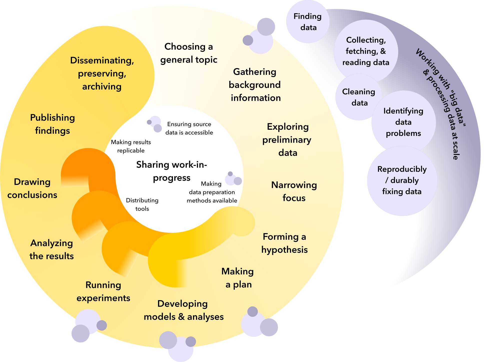

:::::::::::::::::::::::::::::::::::::: questions

* My coursework makes sense. What makes research so much harder?
* This sucks. How can I make sure no one else has to suffer this misery?
* What can I do to feel like part of a research community?
* What can I do to help my work have lasting impact?
* What do I need to think about so that my project doesn't fall apart halfway to the finish line?

::::::::::::::::::::::::::::::::::::::::::::::::

::::::::::::::::::::::::::::::::::::: objectives

* Summarize the phases of a data-centric research project.
* Discuss the benefits of open data principles.
* Briefly describe the modules covered in this course.

::::::::::::::::::::::::::::::::::::::::::::::::

### Setting the scene

You're poking around your research lab's collaborative drive when you find a folder
containing data, code and some notes from a former postdoctoral researcher. They were
investigating patterns in the emissions intensity of electricity production
in Colorado as exploratory work for a potential research project, but wound up pursuing
another idea instead.

As you prepare for your qualifying exams, you're interested in picking up on their
work and developing it further. While they give you the go-ahead over email, they let
you know that they're travelling for field work for the next six months and won't be
able to respond to further questions - the documents in the drive will be your only
source of information going forward.

You are a little alarmed. The data has only hints of where it came from, the code barely has any comments, and the notes are mostly about open TODOs. There are no instructions for running anything. You have your work cut out for you.

:::::::: challenge

#### Introspection: replication

Think of a time you've had to replicate someone else's research results, either as a class assignment or by inheriting a project someone else (maybe past-you) started. What was hard about it? What was easy? What changes could the original author have made to ease your way?

::::::::

This is not a resilient way to work on a research project. Many common events
can cause big challenges:

* someone leaves the project, temporarily or permanently
* the project gets put on pause for a while
* someone new wants to join the project and help out
* someone wants to build new work on top of the project

As you are left to puzzle everything out on your own, you daydream about a
project where these events are much less disruptive. What might that look like?

You'd want to be able to **collaborate** with other people starting early on in
the project - it'd be nice if your other team members could review your work,
provide feedback, and contribute to parts of the analysis. Then if you have to
disappear for a while, other people can carry the project forward.

You'd want to be **open and transparent** about the data - what the inputs are,
what the outputs are, and how you got from A to B. When you're talking to a
potential collaborator, a new teammate, or just getting back into the project
after a break, being able to see the core data flows can save you a lot of
pain.

You'd also want the project outcomes to be **reproducible**, so researchers in
other labs can build on the work that you're about to do, and confirm your
results. Maybe you end up getting a new job, leaving someone else in the lab to
keep the project going. In your new role, you might find that you yourself want
to build on all your old work.

We'll keep these principles in mind as we work through the material in this
course.

### Welcome

Welcome to Open Energy Data for All!

:::: instructor

Deliver this as if you are in an infomercial, and as if everyone is on board with the character you are playing.

::::

* Have you ever struggled with all the weird little auxiliary bits of writing research software?
* Does it ever seem like those weird little auxiliary bits are, like, all of the work you do, and the actual interesting analysis stuff falls by the wayside?
* Do you ever feel like there must be a better way to do your research?

That's all normal. There's a lot to the research process that doesn't get covered in class, and people are usually left to learn through personal struggle. We won't be able to cover all of that material, but we've chosen a few areas to cover in our time together to help close that gap.

### The research life cycle

Research is cyclic by nature: we ask questions about the world, and as we investigate them, we make hypotheses, test those hypotheses, and reveal more questions along with our conclusions.
You may have seen a diagram like this in a research methods class or as part of orientation for your library or research institute.
If not, that's okay!
You don't need to know it by heart to succeed in this course.

{alt="Project life cycle diagram. Main sequence in yellow shows research stages, from choosing a topic to publication and archiving. Central to the yellow cycle is sharing work-in-progress, with components for ensuring source data is available, making data preparation methods available, distributing tools, and making results replicable. Data sequence in grey includes finding, fetching, cleaning, debugging, and fixing problems, with a looming backdrop of dealing with scale. Scattered grey bubbles indicate connections to data processes throughout the research and collaboration components."}

The general flow is clockwise: from choosing a topic, doing some initial exploration, and narrowing your focus, you develop a hypothesis; perhaps that a certain model or analysis might work well with a particular dataset and lead to new insights.
If all your guesses and assumptions turn out to be correct, you run your experiment, collect your results, publish a paper, and move on to the next project... but that rarely happens smoothly in practice.
Maybe you find an implementation detail while developing your model that leads you to refine your intuition about what will work best.
Maybe an experiment reveals an edge case you hadn't considered.
Maybe the analysis shows a suspicious gap that you could investigate with only a small modification to your approach.
You might get almost to the end and find that some early assumption you made was complete nonsense that invalidated all of your results.
Such setbacks are normal -- though heartbreaking -- and often necessary.
Sometimes it's a quick trip backwards, and sometimes it's longer, but it is very common to learn more from something that doesn't quite work than from something that works perfectly on the first try.

Publication is a great way to share what you have learned with others, and learn from others in turn.
However,

- False starts and wrong turns are not often included in research papers, even if a conference or journal would accept negative results.
- When page limits are tight, details about the data processing and code are usually cut before details about the model and results.
- While preprint venues can offer a way to collect feedback in advance of full peer review, it is almost always more focused on assumptions and approach than on troubleshooting a stack trace.
- While many publication venues require code and data to be published alongside each paper, not all do, which can make replicating another lab's results difficult or even impossible.

Introducing collaboration earlier in the research process can help with all of these problems.
If you start your project with code sharing in mind, there will be less cleanup to do at publication time, and it will be easier to ask for advice from other researchers when you run into trouble.
Most people are more willing to look at a nicely-organized and documented GitHub repository than wade into a 5,000-line Python notebook. It is also significantly easier to extract a minimum example of a problem if your code is already organized in functions.
If you select source data that is publicly available, it is more likely that others will have seen and solved the same problems that you will encounter.
There may even be existing tools to clean and process the data you are interested in -- or if not, publishing your cleaning and processing code independently of your research results can pay off on multiple axes. Other researchers will be able to replicate your results more easily if they can rely on a common starting point, you will help increase activity and accelerate development in your research area by reducing toil and duplicated effort, and your tooling can be a source of citations you may not have considered before.

:::::::: challenge

#### Introspection: durability

Think of one of the well-established ideas or techniques in your field of research, something many people have built upon since it was first published. What do you think made that idea so useful? What helped it take hold? What helped it spread?

::::::::

Data has its own mini-cycle. It comes into play fully at the beginning of a project, and then repeats in parts along the way.
When you identify a new data need, either at the beginning of a project or to solve a problem when you're deep in the middle, you will need to locate an appropriate source for that data, and figure out how to access it.
Data can be messy for many reasons, and most projects include part of the code that cleans it and prepares it for further analysis.
Some cleaning steps might be obvious right away, and others might only be discovered after investigating odd behavior you find later.
You might have a clear idea mathematically of what processing and analysis you want to do with the data, but perfectly translating that idea into code rarely happens on the first try.
You will need to develop strategies for checking that your code has done the right thing, and ways to inspect the data at different points in your pipeline when something has gone wrong.
If your project requires large quantities of data, sufficiently large that your computer cannot load it all into memory at once, you will need to use techniques and tools that are built to handle data at scale.

The parts of the research project life cycle that typically receive explicit attention in coursework include selecting a research question, analysis techniques (e.g., selecting the appropriate statistical method), and publication.
Training in the remaining portions is often assumed to happen naturally through research experience, but this is not always effective in practice.
Gaps in these areas can create roadblocks to conducting effective, reproducible and open research, even for experienced researchers.
This course aims to address some of those roadblocks.

:::::::: challenge

#### Introspection: untaught skills

Think of a skill you've found useful in your research that wasn't taught in one of your classes. How did you learn it? Have you taught it to anyone else? Why or why not?

::::::::

#### What we will cover

This course is focused on practical solutions to roadblocks you may encounter in dealing with data, code, and collaboration. We will be following the arc of an open data analysis project in Python, structuring the course into three sections:

Roadblocks to data acquisition:

- My data is in a format I've never worked before
- The data I want to work with is published through an Application Programming Interface
(API), and I don't know how to download it

Roadblocks to data cleaning & processing:

- There's something unexpected about my input data, but I'm not sure what
- The code runs on some of my data, but errors on other input data
- When I re-run my code I get different results, and I'm not sure why
- I have no idea which part of my code is causing a particular problem
- My data changes format or content over time
- My data is too big to work with on a desktop computer

Roadblocks to collaboration:

- I'm not sure how to make it simple for collaborators to run and contribute to my code
- I need to publish my code and/or data for a paper I'm submitting to, but I'm not sure
how best to do so
- A colleague wants to build on my existing code, but I'm not sure how to clearly document
what I've done to make it possible for them to adapt it
- I wrote this code myself six months ago, and I do not recognize it, nor can I remember what I was trying to do

The next episode will discuss reading data in unexpected file formats.

:::::::: instructor

The remaining section is useful, but not central, and can be cut for time if necessary. If cut, direct students to the course website for tips on locating and identifying appropriate datasets for open research projects.

::::::::

But first, we have to locate some data that will help with our research goals.

### Strategies for finding appropriate research data

:::::::: challenge

#### Discussion: challenges in finding data

Think of a time you tried to find a dataset for an energy research project. What was
one unexpected difficulty that came up as you were trying to find an appropriate dataset
to answer your research question? Share with a peer.

::::::::

Our research goal in this course is **TODO**.
In conducting open research, it is best to start right at the beginning, with how we choose our datasets.
Consider the following questions:

- **Relevancy:** Does the data contain the variables you need to answer your question? Does
the spatial and temporal scale of the data match your research needs? For example,
data at the utility level probably won't be sufficient to answer questions about boiler-level operations.
- **Licensing:** People often assume that any content they can download from the internet is
freely available for use. By default, all creative works are protected by copyright – “All rights reserved”
means that nobody can legally use or republish data. Standardized, open licenses are how
a creator gives the public legal permission to use their work, while retaining some control.
Some licenses might impose additional restrictions - e.g.,
prohibiting commercial use, or prohibiting processing and republishing the data as part
of a new dataset. Verify that a dataset's license meets your needs as soon as possible
in the research process.
- **Documentation:** Is the data published with descriptions of any processing done or notable caveats,
explanations of variable definitions, and contact information for any further questions?
- **Level and type of processing:** The more processed a dataset is, the more you're
depending on others' judgement. If you trust those people, and they make it clear what
they’ve done and why, and the result is a dataset that’s much easier to use, this can be
a great trade-off. Pre-processed datasets may combine multiple datasets together,
use extensive validation techniques, or handle missing and outlying values - depending on
your research needs, these can save valuable time and effort or enable you to ask questions
that would otherwise be out of scope for a research project.
- **Format:** Data contained in poorly scanned PDFs will require much more extensive
processing to use than data contained in spreadsheets or computer-optimized data formats
such as Parquet. If you require multiple years of data for your research, look out for
changes in data formats over time.

This lesson will use a few key open energy data sets to illustrate the arc of data
analysis. We also have several recommendations to give you a start finding appropriate data for your own research project, depending on your area of interest:

- For national-scale research, federal agencies such as the EIA, EPA and FERC all publish
free and regularly-updated data.
- For local/state-level research: some states maintain their own data portals (e.g., the
[Alaska Energy Data Gateway](https://akenergygateway.alaska.edu/)), and some ISOs publish
regularly-updated operational data (e.g., [CAISO's hourly data](https://www.caiso.com/todays-outlook)).
- For analysis-ready data: projects such as the [Public Utility Data Liberation (PUDL) project](https://catalystcoop-pudl.readthedocs.io/en/latest/index.html),
[PowerGenome](https://github.com/PowerGenome/PowerGenome?tab=readme-ov-file), **TODO: some more examples** publish pre-processed data that addresses many
of the common foundational challenges that make federal energy data hard to work with.

:::: keypoints

* Open data principles such as reproducibility, transparency, and collaboration make it easier to share, interpret, and build upon research projects.
* A data research project cycles through choosing a topic, initial explorations, forming a hypothesis, developing models and analyses, running experiments, and analyzing and publishing results. Data tasks such as gathering, loading, cleaning, and debugging are guaranteed at the beginning of the process, and may recur throughout as new data needs arise. Collaborate early & collaborate often to avoid pitfalls and more easily climb out of the ones you do fall into.
* This course will discuss data acquisition, cleaning & processing, and collaboration.

::::
