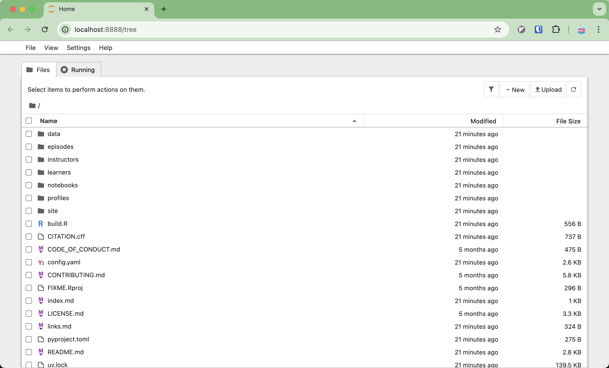
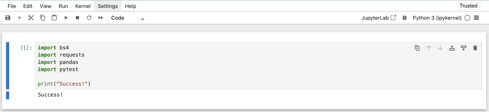

## Setup

You'll need a few things set up before starting the course:

* the course materials should be downloaded to your computer
* the Python libraries used in the course should be installed

We'll assume you have some familiarity with the command line:

* you can run commands
* you can navigate directories with `cd`
* you can inspect directories with `ls` (or `dir` if you're using Command Prompt on Windows)


### Getting the course materials

The course materials are hosted on GitHub and you'll need `git` installed to access them.
Fortunately `git` is free!

Try opening a terminal window and running:

```bash
% git --version
```

If you get some sort of "command not found" error,
follow the [official installation instructions](https://git-scm.com/book/en/v2/Getting-Started-Installing-Git).

Once you have `git` installed, open a terminal window and download a copy of the materials using `git clone`.

Let's assume you have a `courses` directory that you want to store the course materials under.
This will download the materials to `course/open-energy-data-for-all`.

```bash
% cd courses
courses/ % git clone https://github.com/catalyst-cooperative/open-energy-data-for-all.git
```

If you open the `open-energy-data-for-all` directory you just made, you should be able to see the course materials.

```bash
courses/ % cd open-energy-data-for-all
courses/open-energy-data-for-all/ % ls # or dir, if you're in Command Prompt on Windows
CITATION.cff
CODE_OF_CONDUCT.md
...
```

### Installing the Python libraries

To install the Python libraries this course depends on, you will need `uv`.

If you don't have `uv` installed,
check out their [official installation documentation](https://docs.astral.sh/uv/getting-started/installation/).

Once you've installed `uv`, you can use it to install the Python libraries into an isolated environment only for this course.

1. Using a terminal, enter the course repository you downloaded above:
   ```bash
   % cd ~/courses/open-energy-data-for-all
   ```

2. Install the libraries:
   ```bash
   courses/open-energy-data-for-all/ % uv sync
   ```

3. Test out to see if the dependencies were installed by opening a Jupyter notebook:
   ```bash
   courses/open-energy-data-for-all/ % uv run jupyter notebook
   ```

   You should see a directory listing in your browser:

   {alt="A directory listing, showing the contents of the course repository."}

   Click on `/notebooks`, and then double-click the `00-test-installation.ipynb` notebook. You should see a single cell:

   {alt="A cell that imports the high-level dependencies we need in the course."}

   Run that cell - if it doesn't print `Success!`, then you're missing some dependencies for the course.

   Double-check:

   * that you ran `jupyter notebook` with `uv run jupyter notebook`
   * that the libraries that are imported are listed in `pyproject.toml`

   If both are true, contact your instructor for help.
